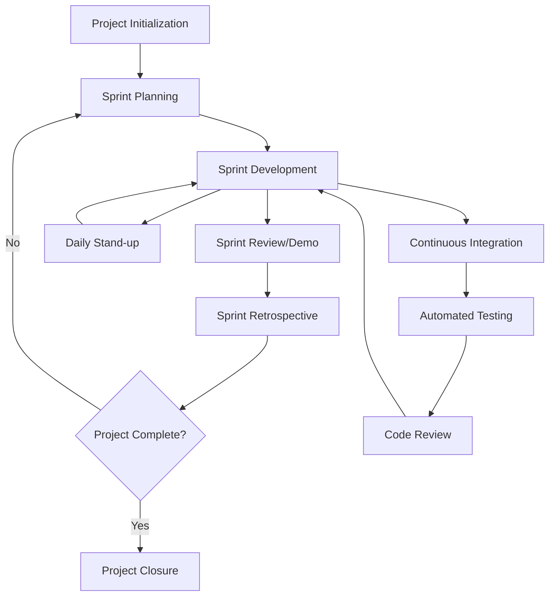

# OpenAutomate Project Management Approach

## 1. Overview 

### 1.1 Scope & Estimation 

| # | WBS Item | Complexity | Est. Effort (man-days) |
|---|----------|------------|------------------------|
| 1 | **Project Infrastructure Setup** | | **25** |
| 1.1 | Repository setup | Simple | 3 |
| 1.2 | Development environment configuration | Simple | 2 |
| 1.3 | Database schema design and setup | Medium | 7 |
| 1.4 | Project architecture implementation | Complex | 10 |
| 1.5 | Documentation setup | Simple | 3 |
| 2 | **Multi-Tenant Architecture** | | **31** |
| 2.1 | Tenant entity and data model implementation | Medium | 5 |
| 2.2 | Tenant resolution middleware | Medium | 6 |
| 2.3 | Tenant context service | Medium | 5 |
| 2.4 | Global query filters implementation | Complex | 10 |
| 2.5 | Tenant-aware repositories | Medium | 5 |
| 3 | **Authentication and Authorization** | | **30** |
| 3.1 | User registration and login functionality | Medium | 6 |
| 3.2 | JWT token implementation with refresh tokens | Complex | 10 |
| 3.3 | Role-based authorization | Medium | 7 |
| 3.4 | Tenant-aware authorization policies | Medium | 7 |
| 4 | **Organization Unit Management** | | **21** |
| 4.1 | Organization CRUD operations | Simple | 4 |
| 4.2 | Organization settings management | Medium | 7 |
| 4.3 | Organization user management | Complex | 10 |
| 5 | **Bot Agent Management** | | **26** |
| 5.1 | Bot agent registration | Medium | 5 |
| 5.2 | Bot agent status tracking | Complex | 10 |
| 5.3 | Machine key generation and management | Medium | 6 |
| 5.4 | Bot agent configuration | Medium | 5 |
| 6 | **Automation Package Management** | | **33** |
| 6.1 | Package metadata CRUD operations | Medium | 6 |
| 6.2 | Package version management | Medium | 7 |
| 6.3 | Package file storage and retrieval | Complex | 10 |
| 6.4 | Package deployment to bot agents | Complex | 10 |
| 7 | **Asset Management** | | **23** |
| 7.1 | Asset CRUD operations | Medium | 5 |
| 7.2 | Asset type definition | Simple | 3 |
| 7.3 | Asset-bot agent relationship management | Medium | 7 |
| 7.4 | Asset properties management | Medium | 8 |
| 8 | **Execution System** | | **32** |
| 8.1 | Execution creation and tracking | Medium | 7 |
| 8.2 | Execution log management | Medium | 6 |
| 8.3 | Real-time execution monitoring | Complex | 10 |
| 8.4 | Execution error handling and retries | Medium | 9 |
| 9 | **Scheduling System** | | **25** |
| 9.1 | Schedule CRUD operations | Medium | 5 |
| 9.2 | Cron expression parser and validator | Medium | 7 |
| 9.3 | Schedule triggering system | Medium | 8 |
| 9.4 | Schedule history tracking | Simple | 5 |
| 10 | **Real-time Communication** | | **28** |
| 10.1 | SignalR hub implementation | Medium | 8 |
| 10.2 | Bot agent connection management | Medium | 7 |
| 10.3 | Tenant-aware SignalR connections | Complex | 10 |
| 10.4 | WebSocket security implementation | Simple | 3 |
| 11 | **Frontend Implementation** | | **35** |
| 11.1 | Dashboard implementation | Medium | 7 |
| 11.2 | Bot agent management UI | Medium | 6 |
| 11.3 | Package management UI | Medium | 7 |
| 11.4 | Execution monitoring UI | Complex | 9 |
| 11.5 | Schedule management UI | Medium | 6 |
| 12 | **Testing and Optimization** | | **22** |
| 12.1 | Unit testing | Medium | 7 |
| 12.2 | Integration testing | Medium | 8 |
| 12.3 | Performance testing and optimization | Complex | 10 |
| **Total Estimated Effort (man-days)** | | | **331** |

### 1.2 Project Objectives

#### Overall Project Objective
The primary objective of the OpenAutomate project is to develop a multi-tenant business process automation management platform that provides organizations with a cost-effective alternative to commercial automation solutions. The platform will enable businesses to create, deploy, monitor, and manage automation processes without vendor lock-in or expensive licensing costs, leveraging Python for automation execution, ASP.NET Core for backend services, and Next.js for the frontend interface.

#### Quality

| # | Testing Stage | Test Coverage | No. of Defects | % of Defect | Notes |
|---|--------------|--------------|--------------|------------|-------|
| 1 | Reviewing | 95% | 45 | 35% | Code reviews, architecture reviews, documentation reviews |
| 2 | Unit Test | 85% | 32 | 23% | Core domain entities, services, and middleware functions |
| 3 | Integration Test | 75% | 28 | 20% | API endpoints, tenant isolation, authentication flows |
| 4 | System Test | 70% | 22 | 16% | End-to-end workflows, real-time communication |
| 5 | Acceptance Test | 90% | 8 | 6% | User workflows, performance validation |

#### Milestone Timeliness (%)
- Project Infrastructure Setup: 100%
- Multi-Tenant Architecture: 95%
- Authentication and Authorization: 90%
- Organization Unit Management: 100%
- Bot Agent Management: 95%
- Automation Package Management: 90%
- Asset Management: 95%
- Execution System: 85%
- Scheduling System: 90%
- Real-time Communication: 85%
- Frontend Implementation: 90%
- Testing and Optimization: 95%

#### Allocated Effort (man-days)

| # | Activity | Effort | % of Total |
|---|----------|--------|------------|
| 1 | Requirements Analysis | 30 | 9% |
| 2 | Architecture and Design | 45 | 14% |
| 3 | Development/Coding | 160 | 48% |
| 4 | Testing | 59 | 18% |
| 5 | Documentation | 15 | 5% |
| 6 | Project Management | 22 | 6% |
|   | **Total** | **331** | **100%** |

### 1.3 Project Risks

| # | Risk Description | Impact | Possibility | Response Plans |
|---|-----------------|--------|------------|----------------|
| 1 | Tenant data isolation failure leading to security breaches | High | Medium | Implement comprehensive unit tests for tenant filtering, conduct regular security audits, perform penetration testing focused on tenant isolation, implement multiple layers of security checks beyond the database level |
| 2 | Team unfamiliarity with multi-tenant architecture patterns | Medium | Medium | Provide training sessions on multi-tenant design, establish architectural decision records, implement pair programming, schedule regular architecture reviews |
| 3 | Resource constraints or unavailability of team members | High | Medium | Cross-train team members, document knowledge, establish clear development practices, identify backup resources |
| 4 | Technical debt accumulation due to rapid development | Medium | High | Schedule regular refactoring sprints, establish code quality metrics, enforce code review standards, implement automated code quality checks |
| 5 | Inconsistent UI/UX across different parts of the application | Low | Medium | Implement a design system, create reusable components, establish UI review process, conduct regular usability testing |
| 6 | Integration challenges between backend services and bot agents | High | Medium | Create detailed API contracts early, implement comprehensive integration tests, develop a simulator for bot agents during initial development, establish clear error handling protocols |

## 2. Management Approach

### 2.1 Project Process

The OpenAutomate project will follow an Agile Scrum methodology with elements of DevOps practices to ensure continuous integration and delivery. This approach allows for iterative development, regular feedback, and adaptation to changing requirements.

**Process Description:**

1. **Project Initialization (2 weeks)**
   - Requirements gathering and analysis
   - Project planning and scheduling
   - Setting up development environment and infrastructure
   - Architectural design

2. **7 Sprint Cycles (2 weeks each)**
   - **Sprint Planning**: Prioritizing backlog items, defining sprint goals
   - **Sprint Development**: Coding, testing, documentation
   - **Daily Stand-up**: 15-minute meetings to synchronize work and address impediments
   - **Continuous Integration/Deployment**: Automated building, testing, and deployment
   - **Sprint Review/Demo**: Demonstrating completed features to stakeholders
   - **Sprint Retrospective**: Reflecting on what went well and what could be improved

3. **Project Closure (1 week)**
   - Final system testing
   - Documentation completion
   - Knowledge transfer
   - Release planning

**Key Practices:**
- Test-Driven Development (TDD) for core components
- Pair programming for complex features
- Continuous code reviews
- Regular refactoring to manage technical debt
- Feature toggles for safe production deployments

### 2.2 Quality Management

The OpenAutomate project will implement a comprehensive quality management strategy to ensure the delivery of a reliable, secure, and high-performance multi-tenant platform.

#### Defect Prevention
- **Architecture Reviews**: Weekly reviews of architectural decisions and implementations
- **Code Style Guidelines**: Implementation of .NET and React coding standards
- **Automated Code Analysis**: Use of static code analysis tools (SonarQube, ESLint)
- **Definition of Done**: Clear criteria for feature completion including security and performance
- **Checklists**: Task-specific checklists for common sources of defects

#### Reviewing
- **Code Reviews**: Mandatory peer review for all code changes
- **Security Reviews**: Dedicated security reviews for authentication, authorization, and tenant isolation
- **Documentation Reviews**: Regular reviews of technical and user documentation
- **Design Reviews**: UI/UX reviews before implementation

#### Unit Testing
- **Test Coverage**: Minimum 85% unit test coverage for core components
- **Unit Test Automation**: Automated test execution on each commit
- **Mock Objects**: Use of mock objects for testing components in isolation
- **Test-Driven Development**: TDD approach for critical components
- **Boundary Testing**: Focus on edge cases and boundary conditions

#### Integration Testing
- **API Testing**: Comprehensive testing of all API endpoints
- **Cross-Component Testing**: Testing interactions between different components
- **Tenant Isolation Testing**: Verification of tenant data isolation
- **Authentication Flow Testing**: Validation of all authentication scenarios
- **Database Integration Testing**: Testing of database operations and migrations

#### System Testing
- **End-to-End Testing**: Testing complete user workflows
- **Performance Testing**: Load and stress testing of the system
- **Security Testing**: Penetration testing and security vulnerability scanning
- **Compatibility Testing**: Testing across different browsers and devices
- **Usability Testing**: Evaluation of user interface and experience

#### Acceptance Testing
- **User Acceptance Testing**: Validation against user requirements
- **Stakeholder Demos**: Regular demonstrations to stakeholders
- **Beta Testing**: Limited release to selected users for feedback
- **Regression Testing**: Ensuring new features don't break existing functionality

### 2.3 Training Plan

| Training Area | Participants | When, Duration | Waiver Criteria |
|---------------|--------------|----------------|-----------------|
| ASP.NET Core & EF Core | Backend Developers | Weeks 1-2, 16 hours | Prior professional experience with ASP.NET Core 6+ and Entity Framework Core 6+ |
| Multi-Tenant Architecture | All Developers | Week 1, 8 hours | Previous implementation of multi-tenant systems with shared database approach |
| Next.js & React | Frontend Developers | Weeks 1-2, 16 hours | Prior professional experience with Next.js 13+ and React 18+ |
| SignalR/WebSockets | Backend & Frontend Developers | Week 2, 8 hours | Previous implementation of real-time communication systems |
| JWT Authentication | Backend & Frontend Developers | Week 2, 8 hours | Prior experience implementing JWT token-based authentication with refresh tokens |
| Entity Framework Core Query Optimization | Backend Developers | Week 3, 8 hours | Proven expertise in EF Core performance optimization |
| Python Automation | Bot Agent Developers | Week 3, 16 hours | Professional Python development experience |
| Git & GitHub | All Team Members | Week 1, 4 hours | Mandatory |
| CI/CD Pipelines | DevOps Specialist, Team Leads | Week 1, 8 hours | Previous experience setting up CI/CD pipelines for .NET Core applications |
| Test Automation | QA Specialists, Developers | Week 2, 16 hours | Prior experience with test automation frameworks for .NET and JavaScript |

## 3. Project Deliverables

| # | Deliverable | Due Date | Notes |
|---|-------------|----------|-------|
| 1 | Project Plan & Requirements Document | 15/05/2025 | Including WBS, schedules, and detailed requirements |
| 2 | Architecture Design Document | 22/05/2025 | Detailed system architecture and component specifications |
| 3 | Development Environment Setup | 29/05/2025 | Including CI/CD pipelines, repository structure, and development tools |
| 4 | Database Schema & Initial Migration | 05/06/2025 | Complete database schema with tenant isolation implementation |
| 5 | Multi-Tenant Core Implementation | 12/06/2025 | Tenant resolution, context, and query filters |
| 6 | Authentication System | 26/06/2025 | Complete JWT implementation with refresh tokens |
| 7 | Organization Management Module | 10/07/2025 | Organization CRUD and user management |
| 8 | Bot Agent Management Module | 24/07/2025 | Bot agent registration, status tracking, and configuration |
| 9 | Automation Package Management | 31/07/2025 | Package creation, versioning, and deployment |
| 10 | Asset Management System | 07/08/2025 | Asset CRUD and relationship management |
| 11 | Execution & Scheduling System | 14/08/2025 | Execution tracking, logging, and scheduling |
| 12 | Real-Time Communication System | 21/08/2025 | SignalR implementation for bot agent communication |
| 13 | Frontend Dashboard & UIs | 28/08/2025 | Complete user interface implementation |
| 14 | System Testing Report | 29/08/2025 | Results of comprehensive system testing |
| 15 | User Documentation | 30/08/2025 | User guides and administration documentation |
| 16 | Final Product Release | 31/08/2025 | Complete platform with all features |

## 4. Responsibility Assignments

D~Do; R~Review; S~Support; I~Informed; <blank>- Omitted

| Responsibility | Hoai | Nhat | Chinh | Hung | Vu |
|----------------|------------------------------|-------------------------------|------------------------|-------------------------|--------------------------------|
| Project Planning & Tracking | S | S | D | S | S |
| Architecture Design | D | S | S | I | S |
| Multi-Tenant Implementation | D | S | S | R | I |
| Database Schema Design | D | I | S | R | I |
| Authentication System | D | S | S | R | I |
| Organization Management | D | S | I | R | I |
| Bot Agent Core System | S | I | S | R | D |
| Automation Package Management | S | S | S | R | D |
| Asset Management | D | S | I | R | I |
| Execution System | S | I | S | R | D |
| Scheduling System | D | S | S | R | I |
| Real-Time Communication | S | S | S | R | D |
| Frontend Dashboard | R | D | S | R | I |
| Bot Agent Management UI | R | D | I | R | S |
| Package Management UI | R | D | I | R | S |
| Execution Monitoring UI | R | D | I | R | S |
| Schedule Management UI | R | D | I | R | I |
| API Documentation | D | S | S | R | S |
| User Documentation | S | D | I | S | S |
| Testing Automation | S | S | S | D | S |
| CI/CD Pipeline | S | S | D | S | S |
| Security Implementation | D | S | S | R | S |
| Performance Optimization | D | D | S | R | D |
| Deployment & Release | S | S | D | S | S |

## 5. Project Communications

| Communication Item | Who/Target | Purpose | When, Frequency | Type, Tool, Method(s) |
|--------------------|------------|---------|----------------|------------------------|
| Daily Stand-up | Development Team | Synchronize work, identify obstacles | Daily, 15 minutes | In-person/MS Teams meeting |
| Sprint Planning | Development Team, Product Owner | Plan sprint work, estimate effort | Bi-weekly, 2 hours | In-person/MS Teams meeting, Azure DevOps |
| Sprint Review | Development Team, Stakeholders | Demonstrate completed features | Bi-weekly, 1 hour | In-person/MS Teams meeting, Demos |
| Sprint Retrospective | Development Team | Reflect on process improvements | Bi-weekly, 1 hour | In-person/MS Teams meeting, Retrospective board |
| Technical Design Reviews | Development Team, Architects | Review and refine technical designs | Weekly, 1 hour | In-person/MS Teams meeting, Architecture diagrams |
| Code Reviews | Developers | Ensure code quality and standards | Ongoing | GitHub pull requests, code review comments |
| Status Reports | Project Manager, Stakeholders | Communicate project status | Weekly | Email, Status report document |
| Issue Resolution | Development Team | Address and resolve issues | As needed | GitHub Issues, MS Teams |
| Documentation Updates | Development Team, Documentation Lead | Keep documentation current | Weekly | GitHub wiki, Markdown documents |
| Security Reviews | Security Team, Development Team | Review security implementation | Bi-weekly | In-person/MS Teams meeting, Security checklist |

## 6. Configuration Management

### 6.1 Document Management

- All project documentation will be stored in the OpenAutomate.Docs GitHub repository
- Documents will follow a clear naming convention: `[Category]-[Name]-[Version].md`
- Version control will be maintained through Git, with meaningful commit messages
- Major document versions will be tagged with semantic versioning (e.g., v1.0.0)
- Document review and approval process:
  1. Author creates document and submits PR
  2. Designated reviewers provide feedback
  3. Author addresses feedback
  4. Final approval by project lead
  5. Merge to main branch
- Change tracking will be maintained in a changelog section for each document
- Documents will be in Markdown format for easy viewing in GitHub
- Sensitive documentation (credentials, security details) will be stored separately with restricted access

### 6.2 Source Code Management

- Source code will be managed using Git and GitHub across multiple repositories:
  - OpenAutomate.Backend
  - OpenAutomate.Frontend
  - OpenAutomate.BotAgent
  - OpenAutomate.Docs
- Branch strategy:
  - `main`: Production-ready code
  - `development`: Integration branch for next release
  - `feature/*`: Feature branches
  - `bugfix/*`: Bug fix branches
  - `release/*`: Release preparation branches
  - `hotfix/*`: Production hotfix branches
- Pull Request (PR) workflow:
  1. Developer creates feature/bugfix branch
  2. Developer implements changes and tests
  3. Developer creates PR to develop branch
  4. Automated checks run (CI pipeline)
  5. Code review by at least one other developer
  6. Changes made based on feedback
  7. Final approval and merge
- Semantic versioning (MAJOR.MINOR.PATCH) for releases
- Automated CI/CD pipeline for build, test, and deployment
- Protected branches requiring PR approvals and passing CI checks
- Conventional commit message format for better changelog generation

### 6.3 Tools & Infrastructures

| Category | Tools / Infrastructure |
|----------|------------------------|
| Technology | ASP.NET Core 8 (Backend), Next.js (Frontend), .NET Worker Service / WPF (Bot Agent), Python (Automation Scripts) |
| Database | SQL Server, Entity Framework Core |
| IDEs/Editors | Visual Studio 2022, Visual Studio Code, JetBrains Rider |
| Diagramming | Draw.io, Mermaid, Lucidchart |
| Documentation | Markdown, GitHub Wiki, Microsoft Office |
| Version Control | Git, GitHub |
| CI/CD | GitHub Actions, Azure DevOps Pipelines |
| Project Management | Azure DevOps Boards, GitHub Projects |
| Testing | xUnit, NUnit, Jest, Playwright, Postman |
| Monitoring | Application Insights, Grafana, Prometheus |
| Deployment | Docker, Kubernetes, Azure App Service |
| Communication | Microsoft Teams, Slack, Email |
| Security | OWASP ZAP, SonarQube, GitHub Advanced Security | 