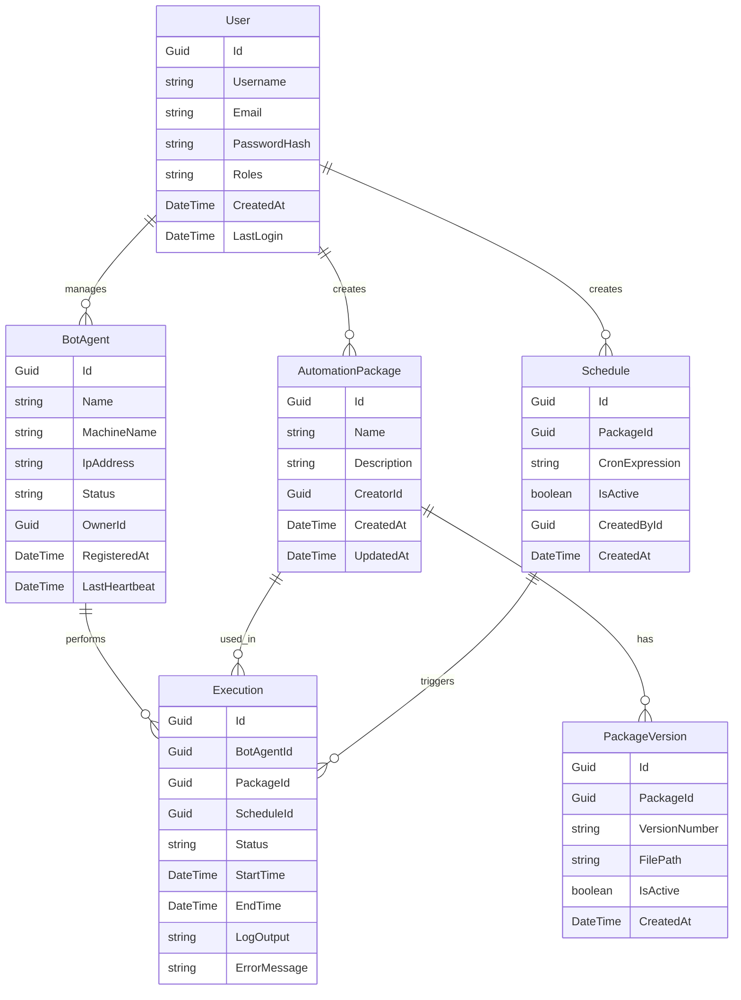
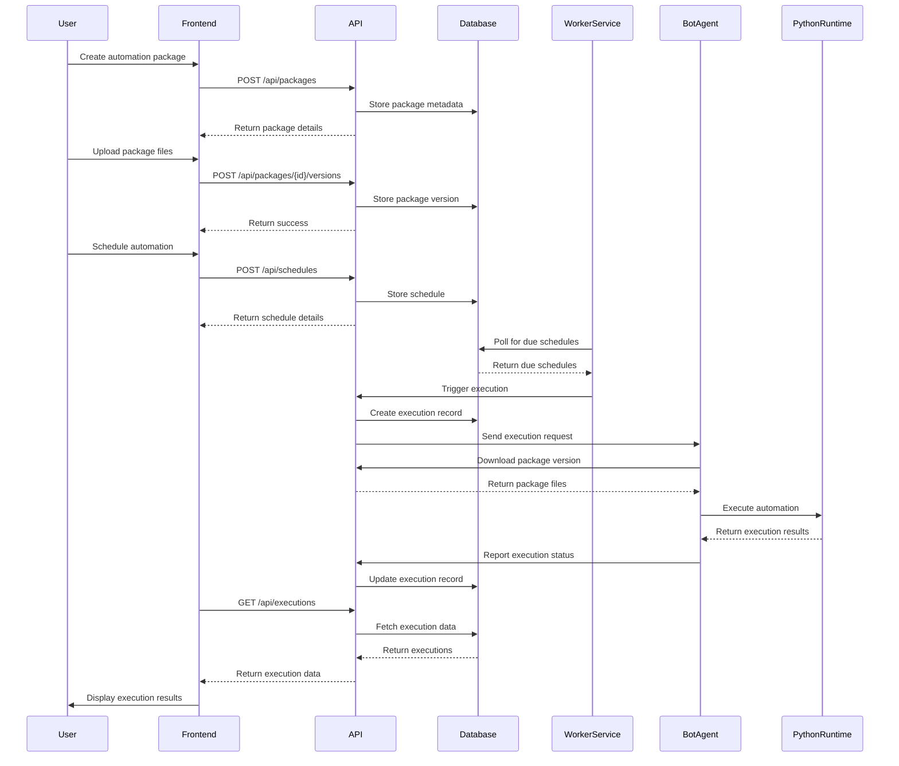

# Technical Design Document: OpenAutomate Platform

## 1. Overview

OpenAutomate is an open-source business process automation management platform designed to provide a cost-effective alternative to commercial automation solutions. It leverages Python for automation execution, ASP.NET Core for backend services, and Next.js for the frontend interface. The platform enables organizations to create, deploy, monitor, and manage automation processes without vendor lock-in or expensive licensing costs.

## 2. Requirements

### 2.1 Functional Requirements

* Users must be able to register and authenticate with the system using credentials or JWT tokens
* Administrators must be able to manage users and assign role-based permissions
* Users must be able to register and manage bot agents across an organization
* Users must be able to create, edit, and deploy automation packages to bot agents
* System must provide real-time monitoring of bot agent status and activities
* System must log all automation executions with detailed information
* Users must be able to schedule automation tasks to run at specific times
* System must provide notifications for automation success, failures, and performance issues
* Users must be able to view performance analytics and metrics for automation processes
* System must support multi-environment configurations (development, testing, production)

### 2.2 Non-Functional Requirements

* System must be secure, with proper authentication, authorization, and data protection
* System must support cross-platform deployment (Windows and Linux)
* Real-time monitoring must have low latency for timely updates
* System must be scalable to handle large numbers of bot agents
* Database access must be efficient for reporting and analytics
* Package distribution must be optimized to minimize network traffic
* UI must remain responsive even with large datasets
* Communication between components must be encrypted
* System must include comprehensive audit logging for compliance and security

## 3. Technical Design

### 3.1. Data Model Changes

The initial database schema will include the following core entities:



### 3.2. API Changes

The API will follow a RESTful design with the following key endpoints:

**Authentication:**
- `POST /api/auth/register` - Register a new user
- `POST /api/auth/login` - Authenticate a user and return JWT token

**User Management:**
- `GET /api/users` - List all users (admin only)
- `GET /api/users/{id}` - Get user details
- `PUT /api/users/{id}` - Update user details
- `DELETE /api/users/{id}` - Delete a user (admin only)

**Bot Agents:**
- `POST /api/agents/register` - Register a new bot agent
- `GET /api/agents` - List all bot agents
- `GET /api/agents/{id}` - Get bot agent details
- `PUT /api/agents/{id}` - Update bot agent details
- `DELETE /api/agents/{id}` - Delete a bot agent

**Automation Packages:**
- `POST /api/packages` - Create a new automation package
- `GET /api/packages` - List all automation packages
- `GET /api/packages/{id}` - Get package details
- `PUT /api/packages/{id}` - Update package details
- `DELETE /api/packages/{id}` - Delete a package
- `POST /api/packages/{id}/versions` - Add a new version to a package
- `GET /api/packages/{id}/versions` - List all versions of a package

**Executions:**
- `POST /api/executions` - Manually trigger an execution
- `GET /api/executions` - List all executions
- `GET /api/executions/{id}` - Get execution details
- `GET /api/executions/{id}/logs` - Get execution logs

**Schedules:**
- `POST /api/schedules` - Create a new schedule
- `GET /api/schedules` - List all schedules
- `GET /api/schedules/{id}` - Get schedule details
- `PUT /api/schedules/{id}` - Update schedule details
- `DELETE /api/schedules/{id}` - Delete a schedule

Example Request/Response:
```json
// POST /api/agents/register
// Request
{
  "name": "Finance-Bot-01",
  "machineName": "FINANCE-PC-01",
  "ipAddress": "192.168.1.100"
}

// Response
{
  "id": "550e8400-e29b-41d4-a716-446655440000",
  "name": "Finance-Bot-01",
  "machineName": "FINANCE-PC-01",
  "ipAddress": "192.168.1.100",
  "status": "Active",
  "ownerId": "7a1b2c3d-4e5f-6a7b-8c9d-0e1f2a3b4c5d",
  "registeredAt": "2023-04-02T12:00:00Z",
  "lastHeartbeat": "2023-04-02T12:00:00Z"
}
```

### 3.3. UI Changes

The frontend will be developed using Next.js with the following key screens:

- **Dashboard**: Overview of system status, recent executions, and key metrics
- **Bot Agents**: List and management of registered bot agents
- **Automation Packages**: Repository of automation packages with version management
- **Executions**: Monitoring and logging of automation executions
- **Schedules**: Configuration of automation schedules
- **User Management**: Administration of users and permissions
- **Settings**: System configuration and preferences

### 3.4. Logic Flow



### 3.5. Dependencies

- **Backend:**
  - ASP.NET Core 8
  - Entity Framework Core
  - SignalR
  - MediatR
  - AutoMapper
  - Hangfire (for scheduling)
  - Serilog (for logging)
  - Swashbuckle (for API documentation)
  - Microsoft.AspNetCore.Authentication.JwtBearer

- **Frontend:**
  - Next.js
  - React
  - shadcn (or similar component library)
  - SWR or React Query (for data fetching)
  - Chart.js (for visualization)
  - Socket.IO client (for WebSocket connections)

- **Bot Agent:**
  - .NET Core runtime
  - Python 3.8+
  - Required Python libraries for automation

### 3.6. Security Considerations

- JWT-based authentication for all API access
- Role-based authorization for feature access
- Encrypted communication via HTTPS
- Secure storage of credentials using appropriate encryption
- Input validation to prevent injection attacks
- CORS configuration to restrict origin access
- Rate limiting to prevent abuse
- Regular security scanning and updates

### 3.7. Performance Considerations

- Database indexing for commonly queried fields
- Caching for frequently accessed data
- Optimized queries for large datasets
- Pagination for list endpoints
- Asynchronous processing for long-running operations
- WebSocket connection pooling for real-time updates
- Efficient package storage and distribution

## 4. Testing Plan

- **Unit Tests:**
  - Core domain entity validation
  - Repository pattern implementation
  - Command and query handlers
  - Controller action logic

- **Integration Tests:**
  - API endpoint functionality
  - Database operations
  - Authentication and authorization flows
  - Bot agent communication

- **End-to-End Tests:**
  - Complete user workflows
  - Package deployment and execution
  - Scheduling and monitoring
  - Real-time updates

- **Performance Testing:**
  - Load testing for concurrent users
  - Stress testing for large numbers of bot agents
  - Response time for critical operations

## 5. Open Questions

- Should package storage use a dedicated file server or cloud storage solution?
- How should we handle long-running automations (hours or days)?
- What level of Python package management should be supported?
- How should we handle bot agent updates and maintenance?
- Should we implement a plugin system for extending the platform?

## 6. Alternatives Considered

- **Single-service architecture** instead of microservices: Rejected due to scalability and separation of concerns requirements.
- **ASP.NET Core MVC with server-side rendering** instead of Next.js: Rejected to provide better user experience with a modern SPA approach.
- **Direct database access** instead of repository pattern: Rejected to maintain clean architecture and separation of concerns.
- **Custom authentication** instead of JWT: Rejected due to industry standards and simplicity of implementation.
- **Using a commercial automation engine** instead of Python: Rejected as it contradicts the open-source and vendor-independence goals. 
