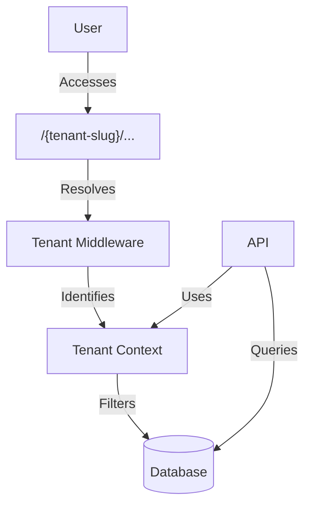
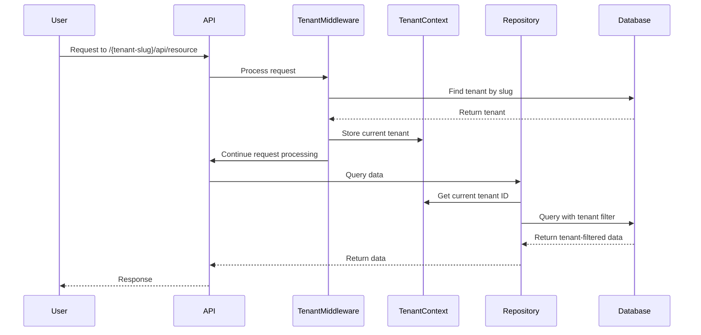
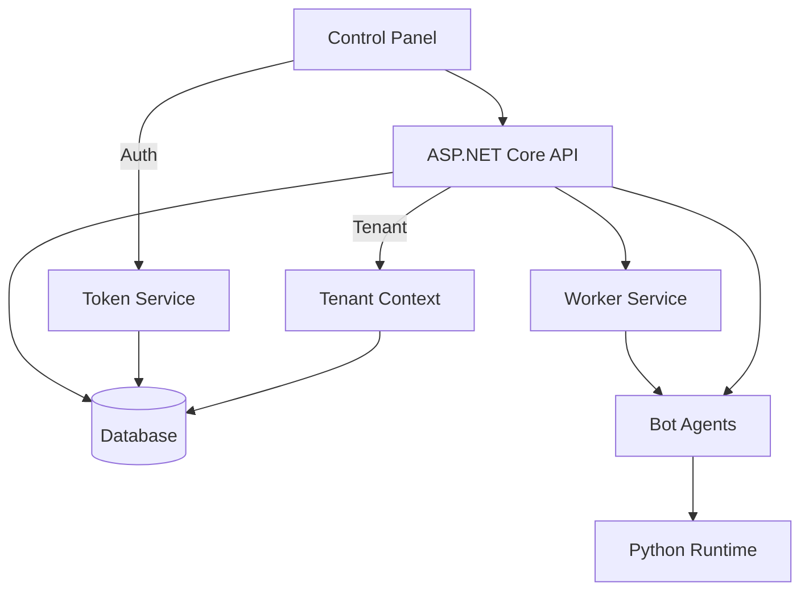
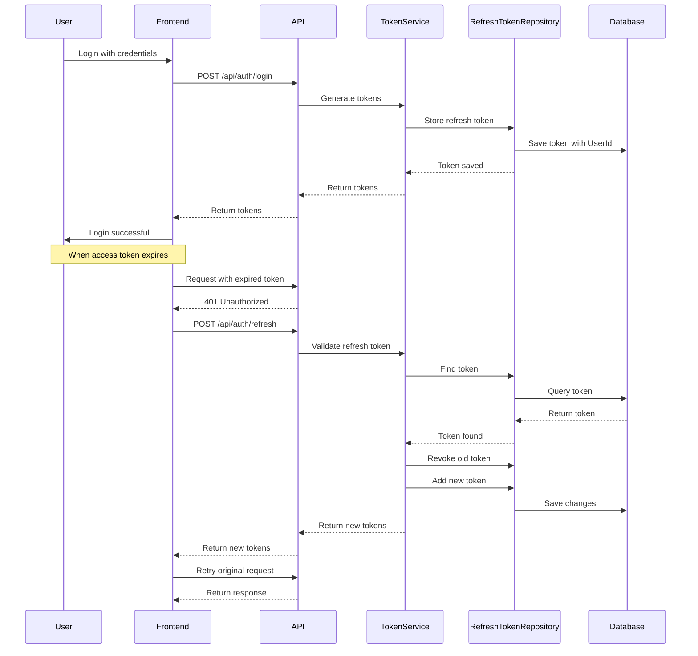

# System Patterns

## Architecture Overview
OpenAutomate follows a distributed microservices architecture with centralized management. The system consists of a web-based control panel (frontend), backend API services, worker services for job processing, and distributed bot agents that execute automation tasks on target machines. The platform is built as a multi-tenant system where each organization represents a tenant, with data isolation implemented through tenant filtering.

## System Components
### Frontend
- Next.js web application for the control panel interface
- React components for dashboard, monitoring, and configuration
- WebSocket connections for real-time updates
- Authentication and authorization system with token refresh mechanism
- Tenant-specific URL routing (/{tenant-slug}/...)

### Backend
- ASP.NET Core API for core business logic and system management
- Entity Framework Core for data persistence
- SignalR for real-time communication
- Worker services for job scheduling and processing
- Python runtime for automation script execution
- JWT authentication service with refresh token support
- Tenant resolution middleware for path-based tenant identification

## Design Patterns
### Used Patterns
- Repository pattern for data access
- Unit of Work pattern for transaction management
- CQRS for command/query separation
- Mediator pattern for decoupling components
- Observer pattern for event notifications
- Factory pattern for creating automation tasks
- Token-based authentication with refresh mechanism
- Multi-tenant pattern with shared database and tenant filtering
- Tenant context pattern for tenant identification and isolation

### Pattern Rationale
- Repository pattern provides abstraction over data access
- Unit of Work pattern ensures transaction consistency
- CQRS separates read and write operations for better scalability
- Mediator enables loose coupling between system components
- Observer pattern facilitates real-time status updates
- Factory pattern simplifies creation of diverse automation tasks
- Refresh token pattern enhances security while maintaining user experience
- Multi-tenant pattern allows efficient resource sharing while maintaining data isolation
- Tenant context pattern ensures proper data filtering across the application

## Multi-Tenant Architecture


## Tenant Resolution Flow


## Component Relationships


## Authentication Flow with Refined Token Management


## Token Storage Pattern
The system uses direct repository access for token management rather than navigation properties to avoid concurrency issues:

```mermaid
graph TD
    TS[Token Service] --> RTR[RefreshToken Repository]
    TS -.-> UR[User Repository]
    RTR --> DB[(Database)]
    UR --> DB
    
    subgraph "Direct Repository Pattern"
    RTR
    end
    
    subgraph "Previous Navigation Property Pattern"
    UR -.-> User
    User -.-> "RefreshTokens Collection"
    end
```

## Data Flow
1. User configures automation package through control panel
2. API processes package and stores configuration in database with tenant ID
3. Worker service picks up scheduled tasks and notifies relevant bot agents
4. Bot agents download and execute automation packages
5. Execution results flow back to API and database
6. Real-time updates sent to control panel via WebSockets

## Security Patterns
- JWT-based authentication for API access with refresh token rotation
- Direct repository access for token management to prevent concurrency issues
- String-based storage with Base64 encoding for tokens
- Role-based authorization for feature access
- Multi-tenant authorization ensuring users can only access their tenant's data
- Encrypted communication between all components
- Secure package storage and distribution
- Audit logging for all system actions
- Token revocation for compromised sessions

## Error Handling
- Global exception handling in API
- Retry mechanisms for transient failures
- Circuit breaker pattern for external service calls
- Detailed logging for troubleshooting
- User-friendly error messages in control panel
- Authentication failure recovery with refresh tokens
- Tenant resolution error handling

## Backend Architecture
OpenAutomate backend follows a clean architecture pattern with the following layers:

1. **Core Layer**: Contains domain models, interfaces, and business logic
2. **Infrastructure Layer**: Contains implementations of interfaces defined in the core layer
3. **API Layer**: Contains controllers, middleware, and API endpoints

### Multi-Tenant Architecture
The system implements a multi-tenant pattern with the following characteristics:

- **Shared Database**: All tenants share the same database with tenant filtering
- **Tenant Resolution**: Path-based tenant identification (/tenant/resource)
- **Data Isolation**: Automatic tenant filtering at the repository level
- **Tenant Context**: Propagation of tenant context throughout the request pipeline

### Repository Pattern
Data access follows the repository pattern with the following components:

- **Generic Repository**: Base repository implementation for common CRUD operations
- **Specialized Repositories**: Extended repositories for specific entity types
- **Unit of Work**: Coordinates the work of multiple repositories in a single transaction
- **Tenant Filtering**: Automatic tenant filtering applied to all queries

### Authentication System
The authentication system follows a token-based pattern with refresh tokens:

- **JWT Authentication**: Short-lived JWTs for API access
- **Refresh Tokens**: Long-lived tokens stored in the database for obtaining new JWTs
- **Token Rotation**: New refresh tokens are issued when refreshing to prevent token reuse
- **HTTP-Only Cookies**: Refresh tokens are stored in HTTP-only cookies for enhanced security
- **EF Core Query Optimization**: Database queries are optimized to avoid using computed properties in LINQ expressions

### Error Handling
The system implements a centralized error handling pattern:

- **Global Exception Middleware**: Catches all unhandled exceptions
- **Structured Error Responses**: Standardized error format for all API responses
- **Logging**: Structured logging of errors with tenant context

## Frontend Architecture

### Component Architecture
The frontend follows a component-based architecture with the following patterns:

- **Page Components**: Next.js pages that define routes
- **Layout Components**: Shared layouts for consistent UI structure
- **Feature Components**: Reusable components for specific features
- **UI Components**: Basic UI elements for consistent styling

### Provider Architecture
The application uses context providers for state management:

- **AuthProvider**: Manages authentication state across the application
- **TenantProvider**: Manages tenant context across the application
- **Provider Composition**: Providers are nested to create a hierarchy of context

### Authentication Patterns
Frontend authentication follows these patterns:

- **Memory-First Storage**: Tokens are primarily stored in memory for security
- **SessionStorage Fallback**: SessionStorage is used as a fallback for page refreshes
- **Auto-Refresh**: Tokens are automatically refreshed before expiration
- **Focus Listener**: Tokens are refreshed when a tab regains focus
- **SSR Compatibility**: Authentication state is handled properly for server-side rendering

### Server-Side Rendering Approach
The application follows a hybrid rendering strategy:

- **Server Components**: Used for data-heavy components that don't need client interactivity
- **Client Components**: Used for interactive components with the 'use client' directive
- **Hydration Management**: Prevents hydration mismatches through consistent rendering strategies
- **Loading States**: Uses consistent loading states that work for both server and client rendering

## API Patterns

### Controller Organization
API controllers are organized following these patterns:

- **Resource-Based Controllers**: Controllers are based on resource types
- **Tenant-Aware Routing**: Routes include tenant identification
- **Standard CRUD Actions**: Consistent action methods across controllers
- **Response Wrapping**: Standardized response format for all endpoints

### Request/Response Patterns
API requests and responses follow these patterns:

- **DTO Pattern**: Data Transfer Objects for request and response data
- **Validation**: Request validation using model validation attributes
- **Standard Response Format**: Consistent response format with status, data, and message
- **Error Responses**: Standard error format for all error responses

## Data Models

### Entity Design
The system uses the following entity design patterns:

- **Base Entity**: Common properties for all entities (Id, Created, Modified)
- **Tenant-Aware Entities**: Entities with tenant identification
- **Navigation Properties**: Entity relationships expressed as navigation properties
- **Computed Properties**: Some properties are computed rather than stored (e.g., token expiration status)

### Data Relationships
Entity relationships follow these patterns:

- **One-to-Many**: Standard EF relationship with navigation properties
- **Many-to-Many**: Join tables with explicit join entities
- **Cascade Delete**: Controlled cascade delete for related entities
- **Tenant Isolation**: Relationships are constrained by tenant boundaries

## Security Patterns

### Authentication and Authorization
The system implements these security patterns:

- **JWT Authentication**: Token-based authentication for API access
- **Cookie-Based Refresh Tokens**: HTTP-only cookies for refresh tokens
- **Token Rotation**: New refresh tokens on each refresh
- **Role-Based Authorization**: Permission checks based on user roles
- **Claims-Based Identity**: User identity based on claims in the JWT

### Data Protection
Data is protected using these patterns:

- **Tenant Isolation**: Data is isolated by tenant
- **Input Validation**: All inputs are validated
- **Output Encoding**: All outputs are properly encoded
- **SQL Injection Prevention**: Using parameterized queries via Entity Framework
- **Password Hashing**: Secure password hashing with modern algorithms

## Communication Patterns

### API Communication
The system uses these patterns for API communication:

- **RESTful API**: Standard REST principles for API design
- **JSON Serialization**: JSON for data exchange
- **HTTP Status Codes**: Appropriate status codes for different responses
- **Compression**: Response compression for reduced bandwidth
- **Content Negotiation**: Support for different content types

### Real-Time Communication
For real-time updates, the system uses:

- **SignalR**: For real-time updates from the server to clients
- **Connection Management**: Proper connection handling with reconnection logic
- **Group-Based Communication**: Updates scoped to tenant groups

## Extension Points

### Plugin Architecture
The system provides these extension points:

- **Bot Agents**: Custom bots can be developed and integrated
- **Automation Packages**: Custom automation logic can be packaged and deployed
- **API Extensions**: API can be extended with custom endpoints
- **Custom Workflows**: Automation workflows can be customized

## Frontend UI Patterns

### Layout Structure
The UI follows these layout patterns:

- **App Shell**: Consistent shell with navigation and user info
- **Tenant Context**: UI elements scoped to the current tenant
- **Responsive Design**: UI adapts to different screen sizes
- **Theme Support**: Support for light and dark themes

### Component Patterns
UI components follow these patterns:

- **Atomic Design**: Components organized by complexity (atoms, molecules, organisms)
- **Controlled Components**: State is controlled by parent components
- **Custom Hooks**: Reusable logic extracted into custom hooks
- **Memoization**: Performance optimization with React.memo and useMemo

### Form Patterns
Forms follow these patterns:

- **Controlled Forms**: Form state managed by React
- **Validation**: Client-side validation with immediate feedback
- **Error Handling**: Clear error messages for validation failures
- **Submission Handling**: Consistent handling of form submission

### Data Loading Patterns
Data loading follows these patterns:

- **Server-Side Data Fetching**: Data fetched on the server when possible
- **Client-Side Fetching**: Client-side fetching for dynamic data
- **Loading States**: Consistent loading indicators
- **Error States**: Graceful error handling for failed data loading 