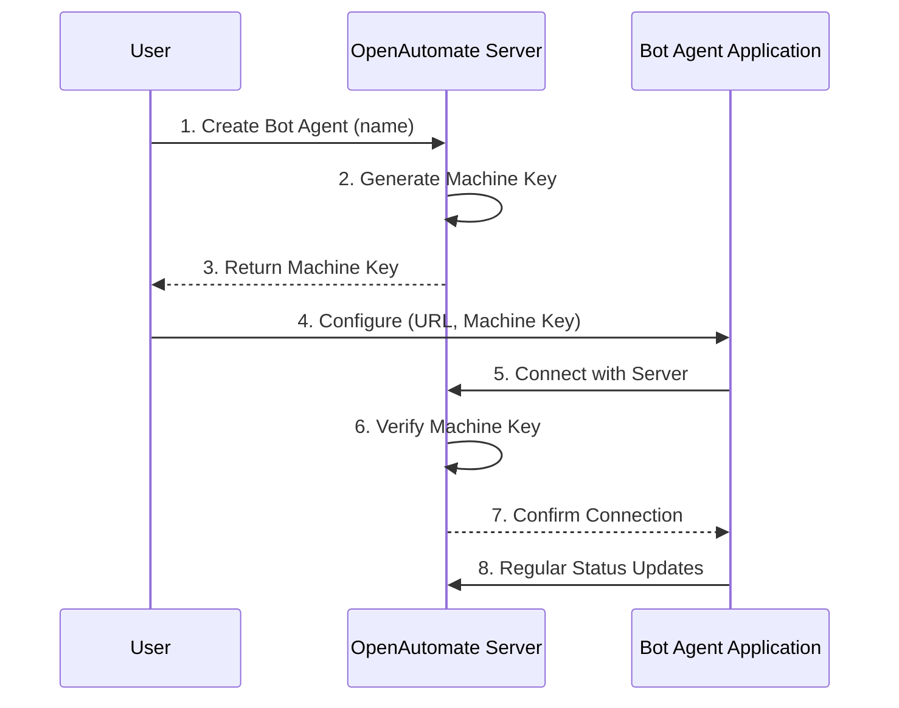

# Bot Agent Management API

## Overview

This document outlines the implementation details of the Bot Agent Management API in OpenAutomate, focusing on the integration and communication between the OpenAutomate server and Bot Agent instances. The API enables secure, tenant-isolated management of automation agents across distributed environments.

## Architecture

The Bot Agent Management API is designed with these key components:

1. **Server-side API**: Endpoints for connection, authentication, and management of Bot Agents
2. **Bot Agent Client**: Client-side implementation for secure communication with the server
3. **Machine Key Authentication**: Security mechanism for Bot Agent identity verification
4. **Multi-tenant Isolation**: Tenant-specific Bot Agent management respecting organization boundaries



## Server-side Implementation

### Data Models

#### BotAgent Entity

```csharp
public class BotAgent : TenantEntity
{
    [Required]
    public string Name { get; set; }
    
    [Required]
    public string MachineName { get; set; }
    
    [Required]
    public string MachineKey { get; set; }
    
    public string Status { get; set; }
    
    public DateTime LastHeartbeat { get; set; }
    
    
    public virtual ICollection<AssetBotAgent> AssetBotAgents { get; set; }

}
```

#### BotAgentDto Classes

```csharp
public class CreateBotAgentDto
{
    [Required]
    public string Name { get; set; }
    
    [Required]
    public string MachineName { get; set; }
}

public class BotAgentResponseDto
{
    public Guid Id { get; set; }
    public string Name { get; set; }
    public string MachineName { get; set; }
    public string MachineKey { get; set; }
    public string Status { get; set; }
    public DateTime? LastConnected { get; set; }
    public bool IsActive { get; set; }
}

public class BotAgentConnectionRequest
{
    [Required]
    public string MachineKey { get; set; }
    
    [Required]
    public string MachineName { get; set; }
    
}
```

### API Endpoints

#### Bot Agent Management (Authenticated User Endpoints)

```csharp
[ApiController]
[Route("{tenant}/api/botAgents")]
[Authorize]
public class BotAgentController : CustomControllerBase
{
    private readonly IBotAgentService _botAgentService;
    
    public BotAgentController(IBotAgentService botAgentService)
    {
        _botAgentService = botAgentService;
    }
    
    /// <summary>
    /// Creates a new Bot Agent and generates a machine key
    /// </summary>
    [HttpPost]
    [RequirePermission(Resources.BotAgentResource, Permissions.Create)]
    public async Task<ActionResult<BotAgentResponseDto>> CreateBotAgent([FromBody] CreateBotAgentDto dto)
    {
        var botAgent = await _botAgentService.CreateBotAgentAsync(dto);
        return CreatedAtAction(nameof(GetBotAgentById), new { id = botAgent.Id }, botAgent);
    }
    
    /// <summary>
    /// Gets a Bot Agent by its ID
    /// </summary>
    [HttpGet("{id}")]
    [RequirePermission(Resources.BotAgentResource, Permissions.View)]
    public async Task<ActionResult<BotAgentResponseDto>> GetBotAgentById(Guid id)
    {
        var botAgent = await _botAgentService.GetBotAgentByIdAsync(id);
        if (botAgent == null)
            return NotFound();
            
        return Ok(botAgent);
    }
    
    /// <summary>
    /// Gets all Bot Agents for the current tenant
    /// </summary>
    [HttpGet]
    [RequirePermission(Resources.BotAgentResource, Permissions.View)]
    public async Task<ActionResult<IEnumerable<BotAgentResponseDto>>> GetAllBotAgents()
    {
        var botAgents = await _botAgentService.GetAllBotAgentsAsync();
        return Ok(botAgents);
    }
    
    /// <summary>
    /// Regenerates the machine key for a Bot Agent
    /// </summary>
    [HttpPost("{id}/regenerateKey")]
    [RequirePermission(Resources.BotAgentResource, Permissions.Update)]
    public async Task<ActionResult<BotAgentResponseDto>> RegenerateMachineKey(Guid id)
    {
        var botAgent = await _botAgentService.RegenerateMachineKeyAsync(id);
        return Ok(botAgent);
    }
    
    /// <summary>
    /// Deactivates a Bot Agent
    /// </summary>
    [HttpPost("{id}/deactivate")]
    [RequirePermission(Resources.BotAgentResource, Permissions.Update)]
    public async Task<IActionResult> DeactivateBotAgent(Guid id)
    {
        await _botAgentService.DeactivateBotAgentAsync(id);
        return NoContent();
    }
}
```

#### Bot Agent Connection and Status (Bot Agent Endpoints)

```csharp
[ApiController]
[Route("{tenant}/api/botAgent")]
public class BotAgentConnectionController : ControllerBase
{
    private readonly IBotAgentService _botAgentService;
    
    public BotAgentConnectionController(IBotAgentService botAgentService)
    {
        _botAgentService = botAgentService;
    }
    
    /// <summary>
    /// Connects or updates a Bot Agent with the server
    /// </summary>
    [HttpPost("connect")]
    public async Task<IActionResult> Connect([FromBody] BotAgentConnectionRequest request, [FromRoute] string tenant)
    {
        try
        {
            var result = await _botAgentService.ValidateAndConnectBotAgentAsync(request, tenant);
            return Ok(result);
        }
        catch (UnauthorizedAccessException)
        {
            return Unauthorized(new { message = "Invalid machine key" });
        }
        catch (Exception ex)
        {
            return BadRequest(new { message = ex.Message });
        }
    }
    
    /// <summary>
    /// Updates Bot Agent status
    /// </summary>
    [HttpPost("status")]
    public async Task<IActionResult> UpdateStatus([FromBody] BotAgentStatusUpdateRequest request, [FromRoute] string tenant)
    {
        try
        {
            await _botAgentService.UpdateBotAgentStatusAsync(request, tenant);
            return Ok();
        }
        catch (UnauthorizedAccessException)
        {
            return Unauthorized(new { message = "Invalid machine key" });
        }
        catch (Exception ex)
        {
            return BadRequest(new { message = ex.Message });
        }
    }
    
    /// <summary>
    /// Gets available assets for Bot Agent
    /// </summary>
    [HttpGet("assets")]
    public async Task<IActionResult> GetAvailableAssets([FromQuery] string machineKey, [FromRoute] string tenant)
    {
        try
        {
            var assets = await _botAgentService.GetAssetsForBotAgentAsync(machineKey, tenant);
            return Ok(assets);
        }
        catch (UnauthorizedAccessException)
        {
            return Unauthorized(new { message = "Invalid machine key" });
        }
        catch (Exception ex)
        {
            return BadRequest(new { message = ex.Message });
        }
    }
}
```

### Service Implementation

```csharp
public class BotAgentService : IBotAgentService
{
    private readonly IUnitOfWork _unitOfWork;
    private readonly ITenantContext _tenantContext;
    private readonly ILogger<BotAgentService> _logger;
    
    public BotAgentService(
        IUnitOfWork unitOfWork,
        ITenantContext tenantContext,
        ILogger<BotAgentService> logger)
    {
        _unitOfWork = unitOfWork;
        _tenantContext = tenantContext;
        _logger = logger;
    }
    
    public async Task<BotAgentResponseDto> CreateBotAgentAsync(CreateBotAgentDto dto)
    {
        // Validate uniqueness of machine name within tenant
        var existingAgent = await _unitOfWork.BotAgents
            .GetFirstOrDefaultAsync(ba => 
                ba.MachineName == dto.MachineName && 
                ba.OrganizationUnitId == _tenantContext.CurrentTenantId);
                
        if (existingAgent != null)
        {
            throw new ApplicationException($"A Bot Agent with machine name '{dto.MachineName}' already exists in this organization");
        }
        
        // Generate a unique machine key (256-bit secure random)
        var machineKey = GenerateSecureMachineKey();
        
        var botAgent = new BotAgent
        {
            Name = dto.Name,
            MachineName = dto.MachineName,
            MachineKey = machineKey,
            Status = "Pending",
            LastConnected = DateTime.UtcNow,
            OrganizationUnitId = _tenantContext.CurrentTenantId
        };
        
        await _unitOfWork.BotAgents.AddAsync(botAgent);
        await _unitOfWork.SaveChangesAsync();
        
        return MapToResponseDto(botAgent);
    }
    
    public async Task<BotAgentResponseDto> ValidateAndConnectBotAgentAsync(
        BotAgentConnectionRequest request, 
        string tenantSlug)
    {
        // Lookup tenant by slug
        var tenant = await _unitOfWork.OrganizationUnits
            .GetFirstOrDefaultAsync(ou => ou.Slug == tenantSlug && ou.IsActive);
            
        if (tenant == null)
        {
            throw new ApplicationException($"Tenant '{tenantSlug}' not found or inactive");
        }
        
        // Find Bot Agent by machine key within tenant
        var botAgent = await _unitOfWork.BotAgents
            .GetFirstOrDefaultAsync(ba => 
                ba.MachineKey == request.MachineKey && 
                ba.OrganizationUnitId == tenant.Id &&
                ba.IsActive);
                
        if (botAgent == null)
        {
            throw new UnauthorizedAccessException("Invalid machine key or Bot Agent is inactive");
        }
        
        // Update Bot Agent information
        botAgent.Status = "Online";
        botAgent.LastConnected = DateTime.UtcNow;
        
        await _unitOfWork.SaveChangesAsync();
        
        _logger.LogInformation("Bot Agent {BotAgentId} successfully connected from {MachineName}", 
            botAgent.Id, request.MachineName);
            
        return MapToResponseDto(botAgent);
    }
    
    private string GenerateSecureMachineKey()
    {
        var key = new byte[32]; // 256 bits
        using (var rng = System.Security.Cryptography.RandomNumberGenerator.Create())
        {
            rng.GetBytes(key);
        }
        return Convert.ToBase64String(key);
    }
    
    private BotAgentResponseDto MapToResponseDto(BotAgent botAgent)
    {
        return new BotAgentResponseDto
        {
            Id = botAgent.Id,
            Name = botAgent.Name,
            MachineName = botAgent.MachineName,
            MachineKey = botAgent.MachineKey,
            Status = botAgent.Status,
            LastConnected = botAgent.LastConnected,
            IsActive = botAgent.IsActive
        };
    }
    
    // Additional methods omitted for brevity...
}
```

## Bot Agent Client Implementation

The Bot Agent application needs to implement a client for communicating with the OpenAutomate server:

```csharp
public class OpenAutomateApiClient
{
    private readonly HttpClient _httpClient;
    private readonly string _baseUrl;
    private readonly string _machineKey;
    
    public OpenAutomateApiClient(string baseUrl, string machineKey)
    {
        _baseUrl = baseUrl.TrimEnd('/');
        _machineKey = machineKey;
        
        _httpClient = new HttpClient();
        _httpClient.DefaultRequestHeaders.Accept.Add(
            new System.Net.Http.Headers.MediaTypeWithQualityHeaderValue("application/json"));
    }
    
    /// <summary>
    /// Connects the Bot Agent with the server
    /// </summary>
    public async Task<bool> ConnectAsync()
    {
        try
        {
            var request = new
            {
                MachineKey = _machineKey,
                MachineName = machineName,
            };
            
            var response = await _httpClient.PostAsJsonAsync(
                $"{_baseUrl}/{_tenantSlug}/api/botAgent/connect", request);
                
            response.EnsureSuccessStatusCode();
            return true;
        }
        catch (Exception ex)
        {
            // Log error
            return false;
        }
    }
    
    /// <summary>
    /// Updates Bot Agent status on the server
    /// </summary>
    public async Task UpdateStatusAsync(string status, string details = null)
    {
        try
        {
            var request = new
            {
                MachineKey = _machineKey,
                Status = status,
                Details = details,
                Timestamp = DateTime.UtcNow
            };
            
            var response = await _httpClient.PostAsJsonAsync(
                $"{_baseUrl}/{_tenantSlug}/api/botAgent/status", request);
                
            response.EnsureSuccessStatusCode();
        }
        catch (Exception ex)
        {
            // Log error
        }
    }
    
    /// <summary>
    /// Gets available assets for the Bot Agent
    /// </summary>
    public async Task<IDictionary<string, string>> GetAssetsAsync()
    {
        try
        {
            var response = await _httpClient.GetAsync(
                $"{_baseUrl}/{_tenantSlug}/api/botAgent/assets?machineKey={Uri.EscapeDataString(_machineKey)}");
                
            response.EnsureSuccessStatusCode();
            
            return await response.Content.ReadFromJsonAsync<Dictionary<string, string>>();
        }
        catch (Exception ex)
        {
            // Log error
            return new Dictionary<string, string>();
        }
    }
}
```

## Bot Agent Connection Process

The connection process links a Bot Agent to a specific tenant in the OpenAutomate system:

1. **Bot Agent Creation (Server-side)**:
   - User logs into OpenAutomate and navigates to the Bot Agents section
   - User clicks "Create Bot Agent" and provides a name and machine name
   - Server generates a secure machine key and stores the Bot Agent record with tenant ID
   - Server returns the machine key to the user (displayed once)

2. **Bot Agent Configuration (Client-side)**:
   - User opens the Bot Agent application on the target machine
   - User enters configuration details:
     - Server URL: The OpenAutomate server URL include tenant slug
     - Machine Key: The generated key from step 1
   - Bot Agent saves configuration securely (encrypted on disk)

3. **Bot Agent Connection (Client-to-Server)**:
   - Bot Agent sends connection request to server including:
     - Machine Key
     - Machine Name
   - Server validates the Machine Key against the tenant
   - Server updates Bot Agent status to "Online"
   - Server sends confirmation response
   - Bot Agent begins regular status updates

## Security Considerations

### Machine Key Protection

1. **Generation**: Machine keys are generated using a cryptographically secure random number generator
2. **Storage**: 
   - Server: Stored in the database, encrypted at rest
   - Client: Stored in an encrypted configuration file
3. **Transmission**: Only transmitted over HTTPS

### Authentication Flow

1. All Bot Agent endpoints authenticate requests using the Machine Key
2. Machine Key is tenant-specific, ensuring tenant isolation

### Tenant Isolation

Bot Agents are subjected to the same tenant isolation rules as other entities:

```csharp
modelBuilder.Entity<BotAgent>()
    .HasQueryFilter(ba => ba.OrganizationUnitId == _tenantContext.CurrentTenantId);
```

This ensures that Bot Agents from one tenant cannot access data from another tenant.

## Monitoring and Health Checks

The Bot Agent API includes endpoints for monitoring:

- **Status Updates**: Regular updates from Bot Agent to server
- **Health Checks**: Periodic verification that Bot Agent is online
- **Last Connected Timestamp**: Tracking when Bot Agent was last active
- **Status History**: Maintaining a history of status changes

## Example Usage Flows

### Server-side: Creating a Bot Agent

```csharp
// In a controller or service
var createDto = new CreateBotAgentDto
{
    Name = "Production Server Bot",
    MachineName = "PROD-SERVER-01"
};

var botAgentResponse = await _botAgentService.CreateBotAgentAsync(createDto);

// The machineKey is now available in botAgentResponse.MachineKey
// This should be displayed to the user for configuration
```

### Client-side: Configuring and Connecting a Bot Agent

```csharp
// In the Bot Agent WPF application
var config = new BotAgentConfig
{
    ServerUrl = "https://openautomateapp.com/acme-corp",
    MachineKey = "YweuCxAzd8rT5Kw9P2BLNj/3lq+GbOaFm1Vse4TpCXA="
};

// Save configuration securely
ConfigManager.SaveConfig(config);

// Create API client
var client = new OpenAutomateApiClient(
    config.ServerUrl,
    config.MachineKey);


var connected = await client.ConnectAsync(
    Environment.MachineName,
    machineKey)

if (connected)
{
    // Start regular status updates
    StartStatusUpdateTimer();
}
```

## Conclusion

The Bot Agent Management API provides a secure, multi-tenant approach to managing distributed automation agents. By implementing machine key authentication and respecting tenant boundaries, the system ensures that Bot Agents only have access to the resources they need while maintaining a clean separation between tenants. 