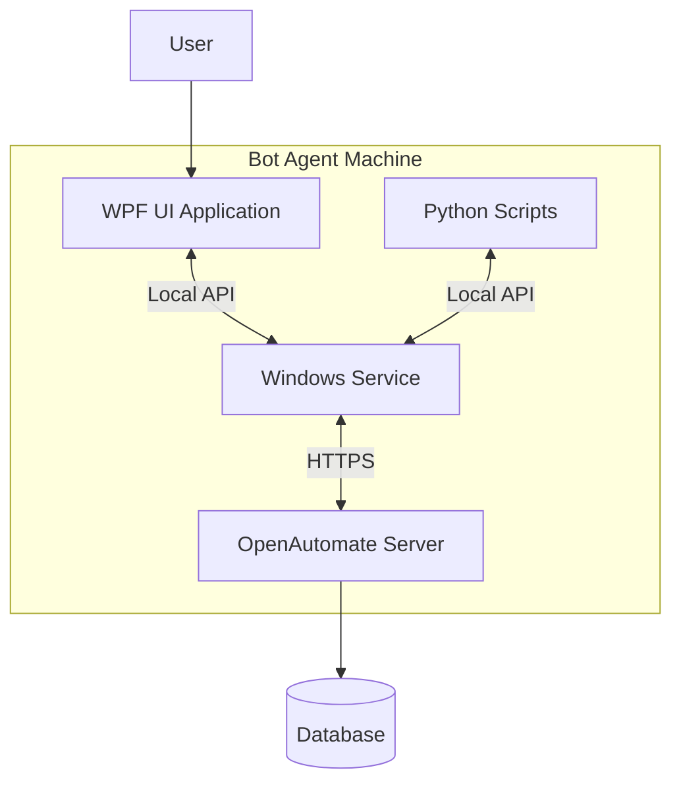
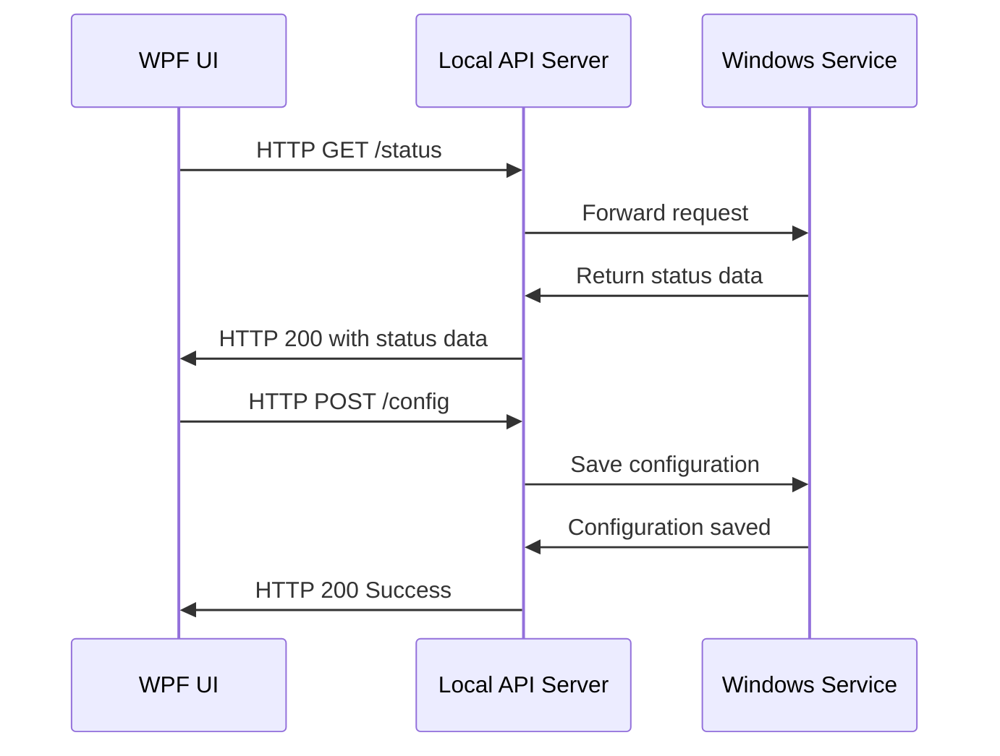
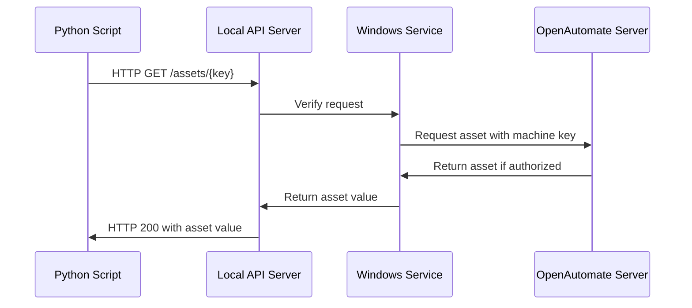
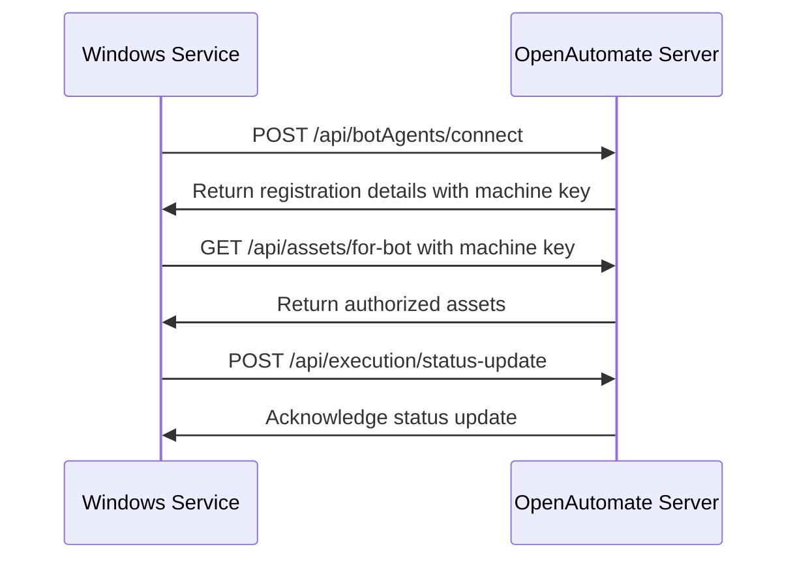

# OpenAutomate Bot Agent Implementation

## Overview
The OpenAutomate Bot Agent is a distributed component of the OpenAutomate platform responsible for executing automation tasks on target machines. It consists of two main parts: a Windows Service running in the background and a WPF user interface for configuration and monitoring. Communication between these components, as well as with Python scripts and the main OpenAutomate server, is facilitated through HTTP APIs with secure machine key authentication.

## System Architecture



## Component Architecture

### Windows Service
The Windows Service runs continuously in the background and has these main responsibilities:
- Maintaining connection with the OpenAutomate server
- Managing the local API server (internal HTTP server on localhost)
- Executing automation tasks
- Managing credential/asset storage
- Handling authentication and machine key verification
- Managing execution logs and status updates

### WPF UI Application
The WPF UI provides a user-friendly interface for:
- Configuring the Bot Agent
- Viewing execution history and logs
- Monitoring current status
- Managing local settings
- Connect the agent with the server
- Generating and managing machine keys

### Local API Server
The local API server (running on localhost:8080 by default) enables:
- Communication between the WPF UI and Windows Service
- Python script access to assets, credentials, and server resources
- Execution control and status updates

## Communication Flows

### 1. WPF UI to Windows Service


### 2. Python Script to Bot Agent


### 3. Bot Agent to OpenAutomate Server


## Machine Key Authentication
The Bot Agent securely communicates with the OpenAutomate server using a cryptographically secure machine key:

1. **Key Generation**: During initial registration, a secure random 256-bit key is generated
2. **Key Storage**: The key is securely stored locally and connected with the server
3. **Authentication**: All API calls to the server include the machine key for identification
4. **Authorization**: The server verifies the machine key and checks permissions before providing access to resources

## Project Structure

```
OpenAutomate.BotAgent/
│
├── OpenAutomate.BotAgent.Service/        # Windows Service project
│   ├── Program.cs                        # Service entry point
│   ├── BotAgentService.cs                # Main service implementation
│   ├── ApiServer/                        # Local API server implementation
│   │   ├── ApiServer.cs                  # HTTP server setup
│   │   ├── Controllers/                  # API endpoints
│   │   │   ├── AssetsController.cs       # Asset retrieval endpoints
│   │   │   ├── StatusController.cs       # Status endpoints
│   │   │   └── ConfigController.cs       # Configuration endpoints
│   ├── Core/                             # Core service functionality
│   │   ├── ExecutionManager.cs           # Manages automation execution
│   │   ├── AssetManager.cs               # Handles secure asset storage
│   │   └── ServerCommunication.cs        # Communicates with OpenAutomate server
│   └── Configuration/                    # Service configuration
│
├── OpenAutomate.BotAgent.UI/             # WPF UI Application project
│   ├── App.xaml                          # Application definition
│   ├── MainWindow.xaml                   # Main application window
│   ├── ViewModels/                       # MVVM view models
│   │   ├── MainViewModel.cs              # Main window view model
│   │   ├── SettingsViewModel.cs          # Settings view model
│   │   └── ExecutionViewModel.cs         # Execution monitoring view model
│   ├── Views/                            # UI views
│   │   ├── SettingsView.xaml             # Agent settings page
│   │   ├── ExecutionView.xaml            # Execution monitoring page
│   │   └── RegistrationView.xaml         # Agent registration page
│   └── Services/                         # UI services
│       ├── ApiClient.cs                  # Client for local API
│       └── NotificationService.cs        # User notifications
│
├── OpenAutomate.BotAgent.Common/         # Shared code between UI and Service
│   ├── Models/                           # Shared data models
│   │   ├── AssetModel.cs                 # Asset data model
│   │   ├── ConfigurationModel.cs         # Configuration data model
│   │   └── ExecutionModel.cs             # Execution data model
│   ├── Interfaces/                       # Shared interfaces
│   │   ├── IApiClient.cs                 # API client interface
│   │   └── IAssetManager.cs              # Asset manager interface
│   └── Security/                         # Security utilities
│       └── MachineKeyManager.cs          # Manages machine key
│
├── OpenAutomate.BotAgent.Installer/      # Installer project
│   ├── Product.wxs                       # WiX installer definition
│   └── Assets/                           # Installer assets
│
└── OpenAutomate.BotAgent.SDK/            # SDK for Python scripts
    ├── openautomateagent/                # Python package
    │   ├── __init__.py                   # Package initialization
    │   ├── client.py                     # API client for Python scripts
    │   └── assets.py                     # Asset retrieval functionality
    └── setup.py                          # Python package setup
```

## Implementation Details

### Windows Service API (localhost:8080)

The Windows Service will expose these key API endpoints:

#### Status and Health
- `GET /api/status`: Get current agent status
- `GET /api/health`: Health check endpoint

#### Configuration
- `GET /api/config`: Get current configuration
- `POST /api/config`: Update configuration
- `GET /api/log`: Get service logs

#### Assets
- `GET /api/assets/{key}`: Get asset value by key

#### Execution
- `POST /api/execution/start`: Start execution of automation
- `GET /api/execution/{id}`: Get execution status
- `POST /api/execution/{id}/stop`: Stop execution

#### Registration
- `GET /api/connection/status`: Check registration status
- `POST /api/connect`: connect with server or update registration

### Security Implementation
1. **Machine Key Storage**: 
   - Windows: DPAPI-protected storage in user context
   - Configuration encrypted at rest
   
2. **API Security**:
   - Local API secured with token-based authentication
   - HTTPS for all server communication
   - Machine key verification for server requests
   - Payload validation and sanitization

3. **Permission Model**:
   - Bot Agents can only access assets explicitly granted to them
   - Tenant isolation enforced through organization unit ID
   - All access attempts logged for audit

## Installation and Setup

### Installation Flow
1. Download Bot Agent installer
2. Run installer package, which:
   - Installs Windows Service
   - Installs WPF application
   - Creates necessary folders and initial configuration
   - Sets up service autostart

### Initial Configuration
Upon first launch of the WPF application:
1. User must connect to an OpenAutomate server
2. User must provide tenant URL, Machine Key of BotAgent created in server at tenant-specific
3. System connects the Bot Agent with the server
4. Bot Agent is now ready to execute automations

### Python SDK Usage
Python scripts can access the Bot Agent API using the included SDK:

```python
from openautomateagent import Client

# Initialize client to local Bot Agent API
agent = Client()

# Get asset from server (automatically authenticated)
secret = agent.get_asset("database_password")

# Use the asset value
print(f"Retrieved secret: {secret}")

# Update execution status
agent.update_status("executing_database_operation")
```

## Monitoring and Logging

### Logging
The Windows Service implements comprehensive logging:
- Windows Event Log integration
- Rotating log files in dedicated log directory
- Log level configuration (Debug, Info, Warning, Error)
- Performance metrics for execution tasks

### Monitoring
The WPF UI provides real-time monitoring:
- Connection status to server
- Current execution status
- Recent execution history
- Resource usage statistics
- Notification system for errors or important events

## Future Enhancements
- Add support for clustered bot agents
- Implement failover and load balancing
- Add secure file transfer capabilities
- Implement auto-update functionality
- Add detailed performance metrics
- Support for Linux-based bot agents 