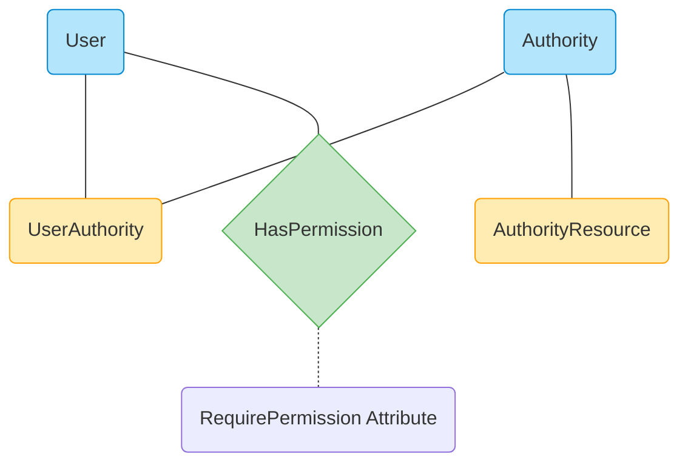
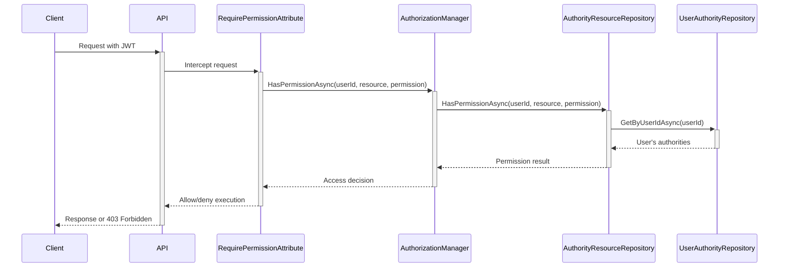

# Role-Based Access Control (RBAC) Developer Guide

## Overview

This guide explains the role-based access control (RBAC) system implemented in OpenAutomate. The system provides granular permission management through authorities (roles) assigned to users, allowing different levels of access to various resources within the application.

## Architecture Components

The RBAC system consists of four primary entities:

1. **User** - Standard user entity that represents an authenticated user
2. **Authority** - Represents a role in the system (e.g., ADMIN, USER, OPERATOR)
3. **UserAuthority** - Join entity connecting users to authorities (roles)
4. **AuthorityResource** - Defines what permissions an authority has for specific resources



## Authorization Flow

1. **Request Initiation**: User makes a request to a protected API endpoint
2. **Authentication**: JWT token validates the user's identity
3. **Authorization Check**: `RequirePermissionAttribute` intercepts the request
4. **Permission Verification**: 
   - Extract user ID from claims
   - Retrieve user's assigned authorities
   - Check if any authority has the required permission for the requested resource
5. **Access Decision**: Allow or deny access based on permission check



## Permission Model

Permissions are represented as integer values with increasing levels of access:

| Permission | Value | Description                                |
|------------|-------|--------------------------------------------|
| View       | 1     | Read-only access to resources              |
| Create     | 2     | Ability to create new resources            |
| Update     | 3     | Ability to modify existing resources       |
| Delete     | 4     | Highest level - can delete resources       |

Permissions are hierarchical - a higher level includes all lower levels. For example, a user with Delete permission (4) automatically has View (1), Create (2), and Update (3) permissions.

## Resources

Resources represent different parts of the system that can have permissions assigned:

```csharp
public static class Resources
{
    public const string AdminResource = "admin";
    public const string EnvironmentResource = "environment";
    public const string AgentResource = "agent";
    public const string PackageResource = "package";
    public const string ScheduleResource = "schedule";
    public const string ExecutionResource = "execution";
    public const string UserResource = "user";
    public const string OrganizationUnitResource = "organizationunit";
}
```

## Multi-Tenant Support

The RBAC system is integrated with multi-tenant architecture:

1. All RBAC entities (`Authority`, `UserAuthority`, and `AuthorityResource`) are tenant-specific
2. Each authority belongs to a specific organization unit (tenant) 
3. Each tenant can define its own authorities, role assignments, and permissions
4. Organization units provide tenant isolation for all RBAC components

## Key Code Components

### RequirePermissionAttribute

```csharp
[AttributeUsage(AttributeTargets.Method | AttributeTargets.Class, Inherited = true, AllowMultiple = true)]
public class RequirePermissionAttribute : Attribute, IAsyncActionFilter
{
    private readonly string _resourceName;
    private readonly int _permission;
    
    public RequirePermissionAttribute(string resourceName, int permission)
    {
        _resourceName = resourceName;
        _permission = permission;
    }
    
    public async Task OnActionExecutionAsync(ActionExecutingContext context, ActionExecutionDelegate next)
    {
        // Get the user ID from the claims
        var userId = context.HttpContext.User.FindFirst(ClaimTypes.NameIdentifier)?.Value;
        if (string.IsNullOrEmpty(userId))
        {
            context.Result = new UnauthorizedResult();
            return;
        }
        
        // Get the authorization service from DI
        var authorizationManager = context.HttpContext.RequestServices
            .GetRequiredService<IAuthorizationManager>();
            
        // Check if user has permission
        var hasPermission = await authorizationManager.HasPermissionAsync(
            Guid.Parse(userId), 
            _resourceName, 
            _permission
        );
        
        if (!hasPermission)
        {
            context.Result = new ForbidResult();
            return;
        }
        
        await next();
    }
}
```

### AuthorizationManager

The `AuthorizationManager` is the central service that coordinates permission checks and role management:

```csharp
public class AuthorizationManager : IAuthorizationManager
{
    private readonly IUnitOfWork _unitOfWork;
    
    // Constructor with dependency injection
    public AuthorizationManager(IUnitOfWork unitOfWork)
    {
        _unitOfWork = unitOfWork;
    }
    
    public async Task<bool> HasPermissionAsync(Guid userId, string resourceName, int permission)
    {
        // Get user's authorities
        var userAuthorities = await GetUserAuthoritiesWithDetailAsync(userId);
        if (!userAuthorities.Any())
            return false;
            
        var authorityIds = userAuthorities.Select(ua => ua.Id);
        
        // Check if any of user's authorities has the required permission for the resource
        var hasPermission = await _unitOfWork.AuthorityResources.GetAllAsync(
            ar => authorityIds.Contains(ar.AuthorityId) && 
                  ar.ResourceName == resourceName && 
                  ar.Permission >= permission);
                  
        return hasPermission.Any();
    }
    
    // Additional methods for authority management
}
```

## Implementation Pattern

The RBAC system follows the UnitOfWork pattern used throughout the application:

1. Authority-related entities are accessed through the standard `IRepository<T>` interface
2. All repositories are accessed via the `IUnitOfWork` interface
3. No specialized repository implementations are needed, following the same pattern as other entities in the system
4. This ensures consistency with the application's architecture and proper transaction management

## Common Usage Patterns

### 1. Assigning a Role to a User

```csharp
await _authorizationManager.AssignAuthorityToUserAsync(userId, "ADMIN");
```

### 2. Adding Resource Permissions to a Role

```csharp
await _authorizationManager.AddResourcePermissionAsync(
    "OPERATOR", 
    Resources.PackageResource, 
    Permissions.Update
);
```

### 3. Checking Permissions in Code

In addition to using the attribute, you can check permissions programmatically:

```csharp
if (await _authorizationManager.HasPermissionAsync(userId, Resources.PackageResource, Permissions.Update))
{
    // Perform the operation
}
else
{
    // Handle unauthorized access
}
```

## Best Practices

1. **Least Privilege** - Assign the minimum permissions needed
2. **Resource Granularity** - Define resources at an appropriate level of granularity
3. **Consistent Protection** - Protect all endpoints with appropriate attributes
4. **UI Integration** - Hide UI elements when users lack appropriate permissions
5. **Testing** - Write tests for permission scenarios

## Troubleshooting

Common issues and solutions:

1. **403 Forbidden responses**:
   - Check user-authority assignments
   - Verify resource permissions for the user's authorities
   - Ensure the correct permission level is required

2. **Missing Authority**:
   - Ensure authorities are properly seeded in the database
   - Check for typos in authority names

3. **Permission not taking effect**:
   - Verify the user's organization unit/tenant context
   - Check if higher-privilege roles are overriding the settings 