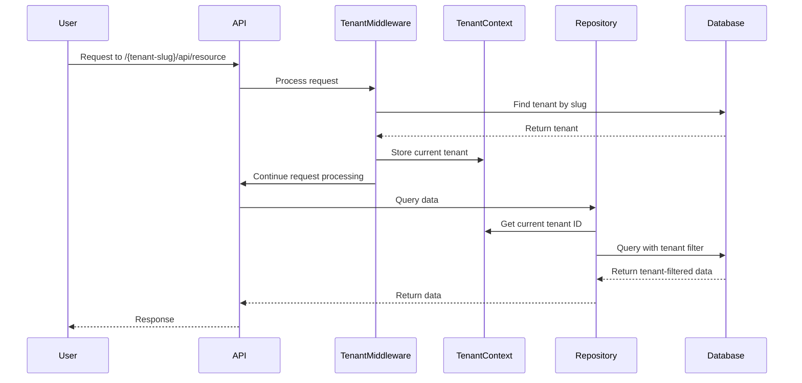
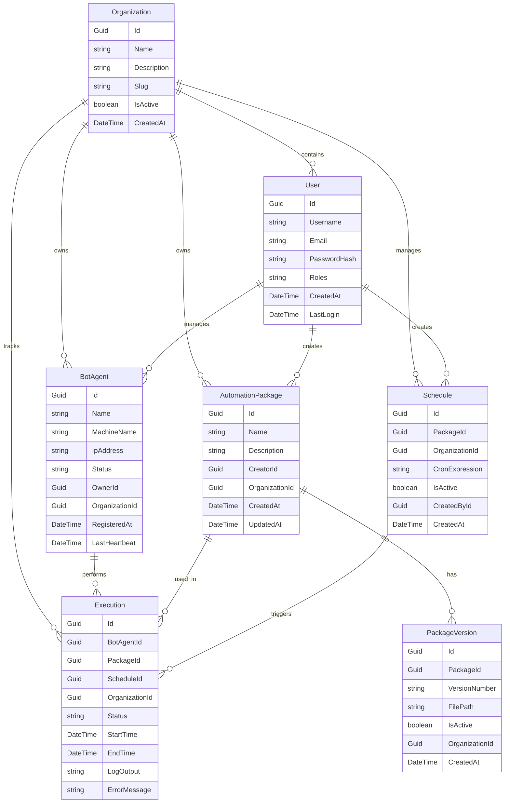
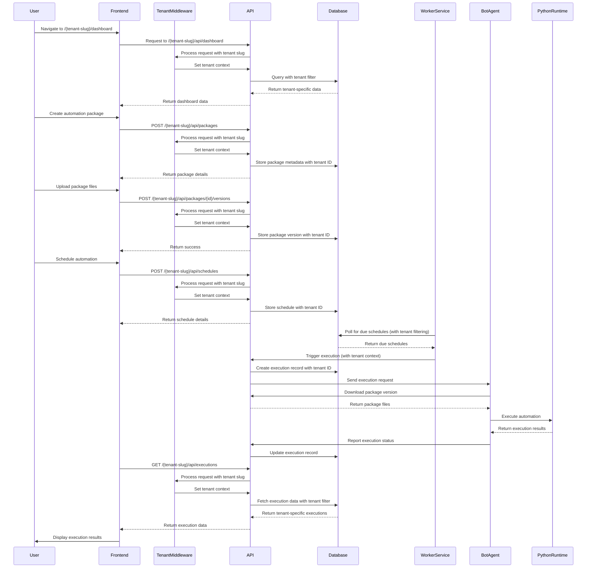
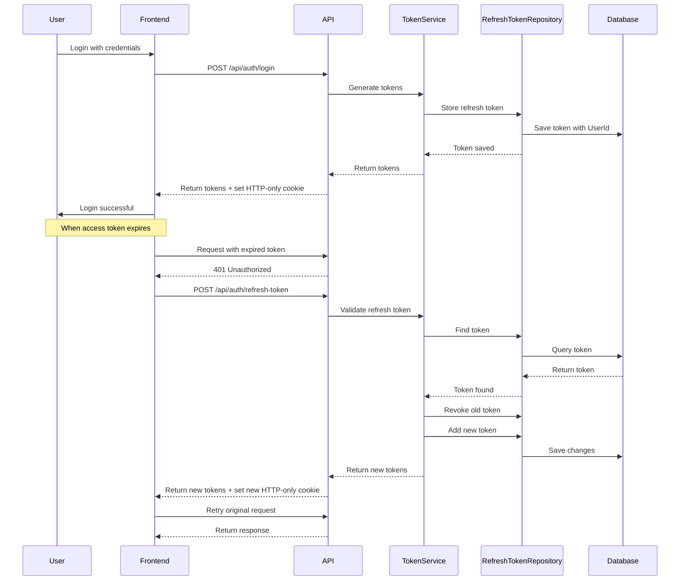

# Technical Design Document: OpenAutomate Platform

## 1. Overview

OpenAutomate is an open-source business process automation management platform designed to provide a cost-effective alternative to commercial automation solutions. It leverages Python for automation execution, ASP.NET Core for backend services, and Next.js for the frontend interface. The platform enables organizations to create, deploy, monitor, and manage automation processes without vendor lock-in or expensive licensing costs.

The platform is built with a multi-tenant architecture, allowing multiple organizations to use the system while ensuring data isolation and security between tenants.

## 2. Requirements

### 2.1 Functional Requirements

* Users must be able to register and authenticate with the system using credentials or JWT tokens
* Administrators must be able to manage users and assign role-based permissions
* Users must be able to register and manage bot agents across an organization
* Users must be able to create, edit, and deploy automation packages to bot agents
* System must provide real-time monitoring of bot agent status and activities
* System must log all automation executions with detailed information
* Users must be able to schedule automation tasks to run at specific times
* System must provide notifications for automation success, failures, and performance issues
* Users must be able to view performance analytics and metrics for automation processes
* System must support multi-environment configurations (development, testing, production)
* System must support multi-tenancy with complete data isolation between organizations

### 2.2 Non-Functional Requirements

* System must be secure, with proper authentication, authorization, and data protection
* System must support cross-platform deployment (Windows and Linux)
* Real-time monitoring must have low latency for timely updates
* System must be scalable to handle large numbers of bot agents
* Database access must be efficient for reporting and analytics
* Package distribution must be optimized to minimize network traffic
* UI must remain responsive even with large datasets
* Communication between components must be encrypted
* System must include comprehensive audit logging for compliance and security
* Tenant isolation must be enforced at the data access layer
* Performance impact of tenant filtering must be minimized

## 3. Technical Design

### 3.1. Multi-Tenant Architecture

OpenAutomate implements multi-tenancy using the shared database with tenant filtering approach:

- A single database instance hosts data for all tenants
- Each tenant-specific entity includes a reference to its tenant (Organization)
- Queries are automatically filtered by the current tenant using Entity Framework Core global query filters
- URL format follows the pattern: `domain.com/{tenant-slug}/api/resource`
- Tenant resolution is handled through middleware that extracts tenant information from the URL path

#### 3.1.1 Key Components

- **Tenant Entity**: Organization entity serves as the tenant identifier
- **Tenant Resolution Middleware**: Extracts tenant information from the URL path
- **Tenant Context Service**: Provides access to the current tenant throughout the application
- **Global Query Filters**: Ensures data isolation between tenants at the database level
- **Tenant-aware Repositories**: Ensures all data operations respect tenant boundaries



### 3.2. Data Model

The database schema includes the following core entities:



### 3.3. API Changes

The API will follow a RESTful design with tenant-specific routing:

**Tenant-specific URL Format:**
- `/{tenant-slug}/api/resource`

**System-wide (Admin) URL Format:**
- `/api/resource`

**Tenant Management:**
- `POST /api/organizations` - Create a new organization (tenant)
- `GET /api/organizations` - List all organizations (admin only)
- `GET /api/organizations/{id}` - Get organization details
- `PUT /api/organizations/{id}` - Update organization details
- `DELETE /api/organizations/{id}` - Delete an organization (admin only)

**Authentication:**
- `POST /{tenant-slug}/api/auth/register` - Register a new user in a tenant
- `POST /{tenant-slug}/api/auth/login` - Authenticate a user and return JWT token with tenant context

**User Management:**
- `GET /{tenant-slug}/api/users` - List users in tenant (tenant admin)
- `GET /{tenant-slug}/api/users/{id}` - Get user details
- `PUT /{tenant-slug}/api/users/{id}` - Update user details
- `DELETE /{tenant-slug}/api/users/{id}` - Delete a user (tenant admin)

**Bot Agents:**
- `POST /{tenant-slug}/api/agents/register` - Register a new bot agent in tenant
- `GET /{tenant-slug}/api/agents` - List all bot agents in tenant
- `GET /{tenant-slug}/api/agents/{id}` - Get bot agent details
- `PUT /{tenant-slug}/api/agents/{id}` - Update bot agent details
- `DELETE /{tenant-slug}/api/agents/{id}` - Delete a bot agent

**Automation Packages:**
- `POST /{tenant-slug}/api/packages` - Create a new automation package
- `GET /{tenant-slug}/api/packages` - List all automation packages in tenant
- `GET /{tenant-slug}/api/packages/{id}` - Get package details
- `PUT /{tenant-slug}/api/packages/{id}` - Update package details
- `DELETE /{tenant-slug}/api/packages/{id}` - Delete a package
- `POST /{tenant-slug}/api/packages/{id}/versions` - Add a new version to a package
- `GET /{tenant-slug}/api/packages/{id}/versions` - List all versions of a package

**Executions:**
- `POST /{tenant-slug}/api/executions` - Manually trigger an execution
- `GET /{tenant-slug}/api/executions` - List all executions in tenant
- `GET /{tenant-slug}/api/executions/{id}` - Get execution details
- `GET /{tenant-slug}/api/executions/{id}/logs` - Get execution logs

**Schedules:**
- `POST /{tenant-slug}/api/schedules` - Create a new schedule
- `GET /{tenant-slug}/api/schedules` - List all schedules in tenant
- `GET /{tenant-slug}/api/schedules/{id}` - Get schedule details
- `PUT /{tenant-slug}/api/schedules/{id}` - Update schedule details
- `DELETE /{tenant-slug}/api/schedules/{id}` - Delete a schedule

Example Request/Response:
```json
// POST /{tenant-slug}/api/agents/register
// Request
{
  "name": "Finance-Bot-01",
  "machineName": "FINANCE-PC-01",
  "ipAddress": "192.168.1.100"
}

// Response
{
  "id": "550e8400-e29b-41d4-a716-446655440000",
  "name": "Finance-Bot-01",
  "machineName": "FINANCE-PC-01",
  "ipAddress": "192.168.1.100",
  "status": "Active",
  "ownerId": "7a1b2c3d-4e5f-6a7b-8c9d-0e1f2a3b4c5d",
  "organizationId": "8b9c0d1e-2f3a-4b5c-6d7e-8f9a0b1c2d3e",
  "registeredAt": "2023-04-02T12:00:00Z",
  "lastHeartbeat": "2023-04-02T12:00:00Z"
}
```

### 3.4. UI Changes

The frontend will be developed using Next.js with tenant-specific routing and the following key screens:

- **Tenant Selection**: For users with access to multiple organizations
- **Dashboard**: Overview of system status, recent executions, and key metrics
- **Bot Agents**: List and management of registered bot agents
- **Automation Packages**: Repository of automation packages with version management
- **Executions**: Monitoring and logging of automation executions
- **Schedules**: Configuration of automation schedules
- **User Management**: Administration of users and permissions
- **Settings**: System configuration and preferences

The URL structure for the frontend will follow the pattern:
`/{tenant-slug}/dashboard`
`/{tenant-slug}/agents`
`/{tenant-slug}/packages`
etc.

### 3.5. Logic Flow



### 3.6. Dependencies

- **Backend:**
  - ASP.NET Core 8
  - Entity Framework Core
  - SignalR
  - MediatR
  - AutoMapper
  - Hangfire (for scheduling)
  - Serilog (for logging)
  - Swashbuckle (for API documentation)
  - Microsoft.AspNetCore.Authentication.JwtBearer
  - Microsoft.AspNetCore.Http.Abstractions (for tenant middleware)

- **Frontend:**
  - Next.js
  - React
  - shadcn (or similar component library)
  - SWR or React Query (for data fetching)
  - Chart.js (for visualization)
  - Socket.IO client (for WebSocket connections)
  - React Context API (for tenant context)

- **Bot Agent:**
  - .NET Core runtime
  - Python 3.8+
  - Required Python libraries for automation

### 3.6. Authentication and Authorization

#### 3.6.1. Authentication Flow

Authentication in OpenAutomate is implemented using JWT tokens with a refresh token mechanism. The system uses HTTP-only cookies for refresh tokens and a memory-first token storage approach on the frontend.



#### 3.6.2. EF Core Query Optimization

When querying refresh tokens, we must be careful with computed properties like `IsExpired` and `IsRevoked` which cannot be translated to SQL by Entity Framework Core. We use a two-step approach:

1. Query the database using only properties that can be translated to SQL
2. Check computed properties in memory after retrieving the entity

```csharp
// Correct approach for RefreshToken method
var token = _unitOfWork.RefreshTokens.GetFirstOrDefaultAsync(
    t => t.Token == refreshToken, // Only query by database fields
    t => t.User).GetAwaiter().GetResult();
    
// Check computed properties in memory
if (token == null || token.IsRevoked || token.IsExpired)
    throw new Exception("Invalid token");
```

#### 3.6.3. Frontend Provider Architecture

The frontend implements a provider architecture for authentication:

1. **AuthProvider**: A React context provider that manages authentication state
2. **TenantProvider**: A React context provider that manages tenant context
3. **Token Storage Strategy**: In-memory token storage with sessionStorage fallback

```tsx
// Provider composition in application root
<AuthProvider>
  <TenantProvider>
    <App />
  </TenantProvider>
</AuthProvider>
```

#### 3.6.4. Token Storage Strategy

The frontend implements a memory-first token storage strategy:

1. Primary storage: In-memory variable (more secure, not accessible to JavaScript)
2. Fallback storage: sessionStorage (persists across page refreshes)

```typescript
// Memory-first token storage
let inMemoryToken: string | null = null;

export const getAuthToken = (): string | null => {
  if (inMemoryToken) return inMemoryToken;
  
  // Fallback to sessionStorage if memory token is not available
  const sessionToken = getTokenFromSession();
  if (sessionToken) {
    inMemoryToken = sessionToken;
  }
  
  return inMemoryToken;
};
```

#### 3.6.5. Server-Side Rendering Considerations

For Next.js applications with server-side rendering (SSR), we implement:

1. Use of 'use client' directive for authentication components
2. Mounted state to prevent hydration mismatches
3. Consistent UI rendering for both server and client

```tsx
// SSR-compatible authentication component
'use client';

import { useState, useEffect } from 'react';
import { useAuth } from '@/lib/hooks/use-auth';

export default function LoginPage() {
  const [mounted, setMounted] = useState(false);
  
  // Set mounted state on client side
  useEffect(() => {
    setMounted(true);
  }, []);
  
  // Only render client-specific content after mount
  if (!mounted) {
    return <div>Loading...</div>; // Static content for SSR
  }
  
  // Client-side content after mount
  return (
    <div>
      {/* Authentication UI */}
    </div>
  );
}
```

#### 3.6.6. Authorization

1. **Role-based access control**:
   - System-level roles: Admin, User
   - Organization-level roles: Tenant Admin, Manager, User

2. **Permission checks**:
   - Resource-based permissions
   - Tenant-scoped permissions

3. **Authorization policies**:
   - Defined in code with policy providers
   - Applied using attributes on controller actions

### 3.7. Security Considerations

- JWT-based authentication for all API access with tenant information embedded in the token
- Role-based authorization for feature access within each tenant
- Multi-tenant authorization ensuring users can only access their tenant's data
- Encrypted communication via HTTPS
- Secure storage of credentials using appropriate encryption
- Input validation to prevent injection attacks
- CORS configuration to restrict origin access
- Rate limiting to prevent abuse
- Tenant validation and isolation at the data access layer
- Regular security scanning and updates

### 3.8. Performance Considerations

- Database indexing for commonly queried fields, especially tenant IDs
- Caching for frequently accessed data with tenant-aware cache keys
- Optimized queries for large datasets with tenant filtering
- Pagination for list endpoints
- Asynchronous processing for long-running operations
- WebSocket connection pooling for real-time updates
- Efficient package storage and distribution
- Monitoring performance impact of tenant filtering

## 4. Testing Plan

- **Unit Tests:**
  - Core domain entity validation
  - Repository pattern implementation with tenant filtering
  - Tenant resolution middleware
  - Tenant context service
  - Command and query handlers with tenant context
  - Controller action logic

- **Integration Tests:**
  - API endpoint functionality with tenant isolation
  - Database operations with tenant filtering
  - Authentication and authorization flows with tenant context
  - Bot agent communication
  - Cross-tenant security tests to verify isolation

- **End-to-End Tests:**
  - Complete user workflows within tenant context
  - Package deployment and execution
  - Scheduling and monitoring
  - Real-time updates
  - Multi-tenant scenarios

- **Performance Testing:**
  - Load testing for concurrent users across multiple tenants
  - Stress testing for large numbers of bot agents
  - Response time for critical operations with tenant filtering
  - Database query performance with tenant filters

## 5. Open Questions

- Should package storage use a dedicated file server or cloud storage solution?
- How should we handle long-running automations (hours or days)?
- What level of Python package management should be supported?
- How should we handle bot agent updates and maintenance?
- Should we implement a plugin system for extending the platform?
- How should we handle cross-tenant operations for system administrators?
- Should we consider database sharding for extremely large deployments?

## 6. Alternatives Considered

- **Single-service architecture** instead of microservices: Rejected due to scalability and separation of concerns requirements.
- **ASP.NET Core MVC with server-side rendering** instead of Next.js: Rejected to provide better user experience with a modern SPA approach.
- **Direct database access** instead of repository pattern: Rejected to maintain clean architecture and separation of concerns.
- **Custom authentication** instead of JWT: Rejected due to industry standards and simplicity of implementation.
- **Using a commercial automation engine** instead of Python: Rejected as it contradicts the open-source and vendor-independence goals.
- **Database-per-tenant** instead of shared database with filtering: Rejected due to operational complexity and resource utilization.
- **Subdomain-based tenant identification** instead of path-based: Rejected for simplicity and fewer infrastructure requirements.
