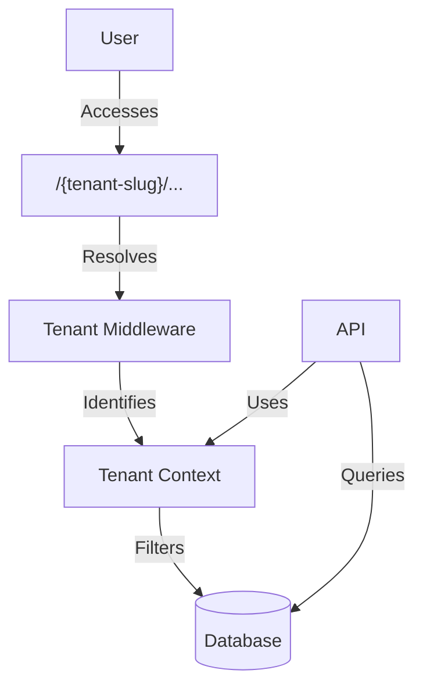
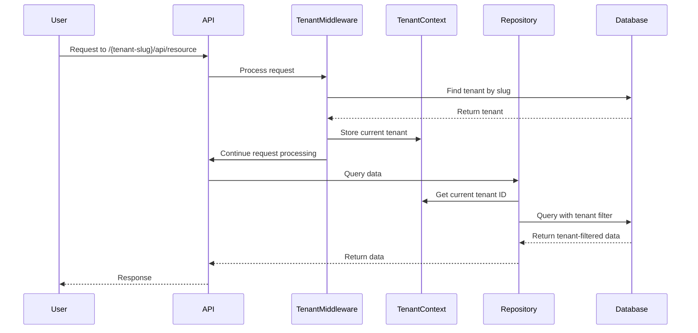
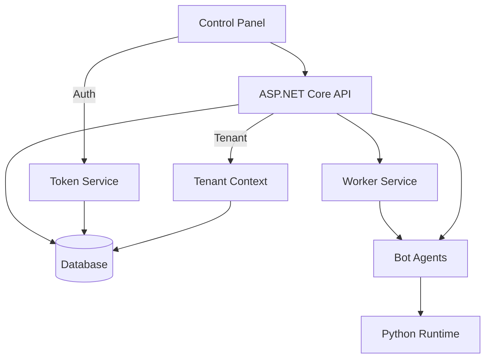
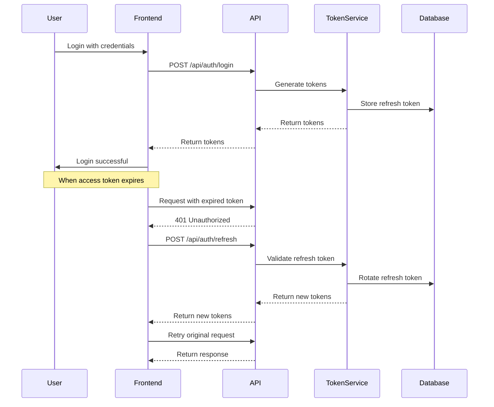

# System Patterns

## Architecture Overview
OpenAutomate follows a distributed microservices architecture with centralized management. The system consists of a web-based control panel (frontend), backend API services, worker services for job processing, and distributed bot agents that execute automation tasks on target machines. The platform is built as a multi-tenant system where each organization represents a tenant, with data isolation implemented through tenant filtering.

## System Components
### Frontend
- Next.js web application for the control panel interface
- React components for dashboard, monitoring, and configuration
- WebSocket connections for real-time updates
- Authentication and authorization system with token refresh mechanism
- Tenant-specific URL routing (/{tenant-slug}/...)

### Backend
- ASP.NET Core API for core business logic and system management
- Entity Framework Core for data persistence
- SignalR for real-time communication
- Worker services for job scheduling and processing
- Python runtime for automation script execution
- JWT authentication service with refresh token support
- Tenant resolution middleware for path-based tenant identification

## Design Patterns
### Used Patterns
- Repository pattern for data access
- CQRS for command/query separation
- Mediator pattern for decoupling components
- Observer pattern for event notifications
- Factory pattern for creating automation tasks
- Token-based authentication with refresh mechanism
- Multi-tenant pattern with shared database and tenant filtering
- Tenant context pattern for tenant identification and isolation

### Pattern Rationale
- Repository pattern provides abstraction over data access
- CQRS separates read and write operations for better scalability
- Mediator enables loose coupling between system components
- Observer pattern facilitates real-time status updates
- Factory pattern simplifies creation of diverse automation tasks
- Refresh token pattern enhances security while maintaining user experience
- Multi-tenant pattern allows efficient resource sharing while maintaining data isolation
- Tenant context pattern ensures proper data filtering across the application

## Multi-Tenant Architecture

## Tenant Resolution Flow

## Component Relationships

## Authentication Flow

## Data Flow
1. User configures automation package through control panel
2. API processes package and stores configuration in database with tenant ID
3. Worker service picks up scheduled tasks and notifies relevant bot agents
4. Bot agents download and execute automation packages
5. Execution results flow back to API and database
6. Real-time updates sent to control panel via WebSockets

## Security Patterns
- JWT-based authentication for API access with refresh token rotation
- Role-based authorization for feature access
- Multi-tenant authorization ensuring users can only access their tenant's data
- Encrypted communication between all components
- Secure package storage and distribution
- Audit logging for all system actions
- Token revocation for compromised sessions

## Error Handling
- Global exception handling in API
- Retry mechanisms for transient failures
- Circuit breaker pattern for external service calls
- Detailed logging for troubleshooting
- User-friendly error messages in control panel
- Authentication failure recovery with refresh tokens
- Tenant resolution error handling 