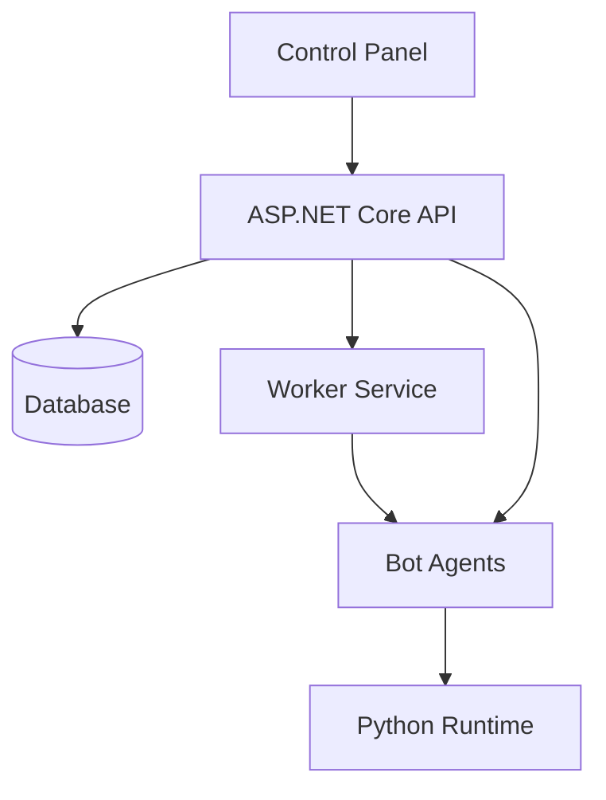

# System Patterns

## Architecture Overview
OpenAutomate follows a distributed microservices architecture with centralized management. The system consists of a web-based control panel (frontend), backend API services, worker services for job processing, and distributed bot agents that execute automation tasks on target machines.

## System Components
### Frontend
- Next.js web application for the control panel interface
- React components for dashboard, monitoring, and configuration
- WebSocket connections for real-time updates
- Authentication and authorization system

### Backend
- ASP.NET Core API for core business logic and system management
- Entity Framework Core for data persistence
- SignalR for real-time communication
- Worker services for job scheduling and processing
- Python runtime for automation script execution

## Design Patterns
### Used Patterns
- Repository pattern for data access
- CQRS for command/query separation
- Mediator pattern for decoupling components
- Observer pattern for event notifications
- Factory pattern for creating automation tasks

### Pattern Rationale
- Repository pattern provides abstraction over data access
- CQRS separates read and write operations for better scalability
- Mediator enables loose coupling between system components
- Observer pattern facilitates real-time status updates
- Factory pattern simplifies creation of diverse automation tasks

## Component Relationships

## Data Flow
1. User configures automation package through control panel
2. API processes package and stores configuration in database
3. Worker service picks up scheduled tasks and notifies relevant bot agents
4. Bot agents download and execute automation packages
5. Execution results flow back to API and database
6. Real-time updates sent to control panel via WebSockets

## Security Patterns
- JWT-based authentication for API access
- Role-based authorization for feature access
- Encrypted communication between all components
- Secure package storage and distribution
- Audit logging for all system actions

## Error Handling
- Global exception handling in API
- Retry mechanisms for transient failures
- Circuit breaker pattern for external service calls
- Detailed logging for troubleshooting
- User-friendly error messages in control panel 